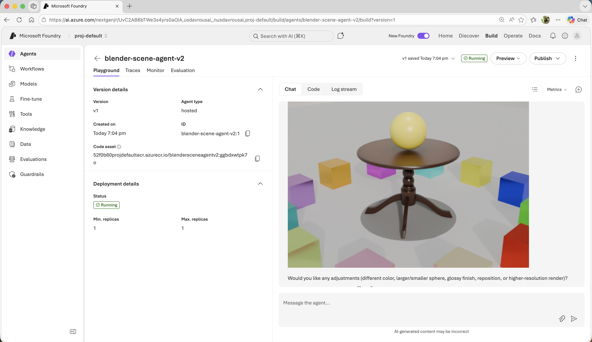

# Blender Scene Agent

An AI agent that creates and manipulates 3D scenes in a headless Blender instance running inside Docker. Built with the **Microsoft Agent Framework** and **Azure AI Foundry**, it communicates with Blender via the [BlenderMCP](https://github.com/ahujasid/blender-mcp) TCP socket protocol.

## Architecture

```
┌─────────────────────────────────────────────────────────┐
│  Docker Container                                       │
│                                                         │
│  ┌──────────┐    ┌──────────────────┐    ┌───────────┐  │
│  │  Xvfb    │◄───│  Blender 4.2     │    │  Python   │  │
│  │ :99      │    │  (background)    │◄──►│  Agent    │  │
│  │ virtual  │    │                  │TCP │  Server   │  │
│  │ display  │    │  blender_startup │9876│  :8088    │  │
│  └──────────┘    │  .py (socket     │    │           │  │
│                  │   server)        │    │  main.py  │  │
│                  └──────────────────┘    └─────┬─────┘  │
│                                               │        │
└───────────────────────────────────────────────┼────────┘
                                                │ HTTPS
                                     ┌──────────▼──────────┐
                                     │  Azure AI Foundry   │
                                     │  (GPT-4.1-mini)     │
                                     └─────────────────────┘
```

## Features

- **Create 3D objects**: Cubes, spheres, cylinders, cones, torus, planes, monkeys
- **Apply materials**: Hex colors with metallic/roughness control
- **Poly Haven integration**: Search and download free HDRIs, textures, and 3D models
- **Viewport screenshots**: Capture and return the current viewport as base64 PNG
- **Full render**: Render scenes with EEVEE or Cycles engines
- **Arbitrary code execution**: Run custom Blender Python code for advanced operations
- **Per-conversation scene isolation**: Each conversation gets its own Blender scene, saved/restored from Azure Blob Storage

## Files

| File | Purpose |
|------|---------|
| `main.py` | Agent server with 13 tool functions, Azure AI Foundry client |
| `blender_startup.py` | Blender addon (runs inside Blender) - TCP socket server on port 9876 |
| `blender_connection.py` | TCP client module used by the agent to talk to Blender |
| `scene_manager.py` | Per-conversation Blender scene isolation with Azure Blob Storage persistence |
| `entrypoint.sh` | Docker entrypoint: starts Xvfb, Blender, then Agent server |
| `agent.yaml` | Agent metadata and environment variable declarations |
| `Dockerfile` | Ubuntu 22.04 + Blender 4.2 + Python deps |

## Per-Conversation Scene Isolation

The agent supports **multiple concurrent conversations**, each with its own isolated Blender scene. This is handled by the `SceneIsolationMiddleware` (in `main.py`) and `SceneManager` (in `scene_manager.py`).

### How it works

1. **User A** starts a conversation and builds a scene. At the end of each request, the Blender scene is saved as a `.blend` file and uploaded to Azure Blob Storage, keyed by the conversation's thread ID.
2. **User B** starts a separate conversation. User A's scene is automatically saved, Blender is reset to a clean state, and User B gets a fresh scene.
3. **User A returns** in the same conversation. User B's scene is saved, and User A's scene is restored from Blob Storage — exactly as they left it.

Scenes are stored in the `blender-scenes` container in Azure Blob Storage under `scenes/<thread-id>.blend`. The container is created automatically on first use.

### Thread ID lifecycle

The conversation identifier comes from `context.thread.service_thread_id` in the Microsoft Agent Framework. On the **first request** of a new conversation, this ID is `None` (the Azure AI service assigns it during the streaming run). The middleware handles this by:
- Skipping scene activation on first request (Blender starts clean)
- Reading the thread ID **after streaming completes** (by which point the framework has set it) for the save operation
- On subsequent requests, the thread is loaded from the `InMemoryAgentThreadRepository` with the ID already set

## Prerequisites

- Docker
- An Azure AI Foundry project with a deployed model (e.g., `gpt-4.1-mini`)
- Azure credentials configured (e.g., `az login`)
- The Azure account used with `az login` (for local development) must have the **Storage Blob Data Contributor** role on the storage account. This is required to upload screenshots and save Blender scenes to Blob Storage. See [step 2](#2-assign-the-storage-blob-data-contributor-role) below for the role assignment command.

## Setup for your own Azure environment

### 1. Create an Azure Blob Storage account and container

The agent uploads viewport screenshots and rendered images to Azure Blob Storage so they can be returned as URLs to the user (see the `upload_image_to_blob` function in `main.py`). The container used is called **`screenshots`**.

Create a storage account (or use an existing one):

```bash
az storage account create \
  --name <your-storage-account-name> \
  --resource-group <your-resource-group> \
  --location <your-location> \
  --sku Standard_LRS \
  --allow-blob-public-access true
```

> The `screenshots` container will be created automatically by the agent on first use if it does not exist.

### 2. Assign the Storage Blob Data Contributor role

The agent authenticates to Blob Storage using `DefaultAzureCredential`. This role is needed to upload screenshots and save/restore per-conversation Blender scenes.

- **Hosted in Azure AI Foundry**: assign the role to the **Foundry Project's managed identity (service principal)**.
- **Local development**: assign the role to **your own Azure account** (the one used with `az login`).

```bash
# For the Foundry managed identity:
az role assignment create \
  --assignee <foundry-project-service-principal-id> \
  --role "Storage Blob Data Contributor" \
  --scope /subscriptions/<subscription-id>/resourceGroups/<resource-group>/providers/Microsoft.Storage/storageAccounts/<your-storage-account-name>

# For your local dev account:
az role assignment create \
  --assignee <your-azure-account-email-or-object-id> \
  --role "Storage Blob Data Contributor" \
  --scope /subscriptions/<subscription-id>/resourceGroups/<resource-group>/providers/Microsoft.Storage/storageAccounts/<your-storage-account-name>
```

> **Tip:** You can find the Foundry Project service principal (object ID) in the Azure Portal under your AI Foundry project's **Identity** blade, or by running:
> ```bash
> az ad sp show --id <client-id-of-your-foundry-project> --query id -o tsv
> ```

### 3. Update the `.env` file

Copy or edit the `.env` file at the root of this project to match your environment:

```env
PROJECT_ENDPOINT=https://<your-foundry-resource>.services.ai.azure.com/api/projects/<your-project-name>
MODEL_DEPLOYMENT_NAME=gpt-4.1-mini
AZURE_STORAGE_ACCOUNT_NAME=<your-storage-account-name>
```

| Variable | Description |
|----------|-------------|
| `PROJECT_ENDPOINT` | The full endpoint URL of your Azure AI Foundry project |
| `MODEL_DEPLOYMENT_NAME` | The name of the model deployment to use (e.g., `gpt-4.1-mini`) |
| `AZURE_STORAGE_ACCOUNT_NAME` | The name of the Azure Storage account created in step 1 |

## Build & Run

### Build the Docker image

```bash
docker build -t blender-scene-agent .

docker build --platform linux/amd64 --no-cache -t blender-scene-agent .    
```

### Run the container

```bash
docker run -it --rm \
  -p 8088:8088 \
  -e PROJECT_ENDPOINT="https://your-project.services.ai.azure.com/api/projects/your-project-id" \
  -e MODEL_DEPLOYMENT_NAME="gpt-4.1-mini" \
  -e AZURE_CLIENT_ID="..." \
  -e AZURE_TENANT_ID="..." \
  -e AZURE_CLIENT_SECRET="..." \
  blender-scene-agent
```

#### macOS / Linux

```bash
docker run -it --rm -p 8088:8088 \
  --env-file .env \
  -v ~/.azure:/root/.azure:ro \
  blender-scene-agent
```

#### Windows (PowerShell)

By default, the Azure CLI on Windows encrypts the token cache with DPAPI (a Windows-only API), so a Linux container cannot read mounted credentials. To get the same seamless experience as macOS, disable token cache encryption on your Windows host:

```powershell
# Run once on your Windows host:
az config set core.encrypt_token_cache=false
az account clear
az login
```

> **Security note:** This stores Azure tokens in plaintext in `%USERPROFILE%\.azure`. This is the same behavior as on macOS/Linux. Re-enable encryption later with `az config set core.encrypt_token_cache=true` if needed.

1. **Ensure your `.env` file uses Unix (LF) line endings**, not Windows (CRLF). CRLF line endings cause `\r` to be appended to environment variable values inside the container, which breaks authentication. You can convert it in VS Code (click "CRLF" in the status bar and select "LF") or run:
   ```powershell
   $c = Get-Content .env -Raw; $c -replace "`r`n","`n" | Set-Content .env -NoNewline
   ```

2. Run the container with the volume mount — same as macOS:
   ```powershell
   docker run -it --rm -p 8088:8088 --env-file .env -v "${env:USERPROFILE}/.azure:/root/.azure:ro" blender-scene-agent
   ```

**Fallback (without unencrypted cache):** If you prefer not to disable encryption, omit the `-v` mount. The container will detect missing credentials and prompt an `az login --use-device-code` flow:
   ```powershell
   docker run -it --rm -p 8088:8088 --env-file .env blender-scene-agent
   ```

Or mount Azure CLI credentials for local development (macOS/Linux):

```bash
docker run -it --rm \
  -p 8088:8088 \
  -e PROJECT_ENDPOINT="..." \
  -e MODEL_DEPLOYMENT_NAME="gpt-4.1-mini" \
  -v ~/.azure:/root/.azure:ro \
  blender-scene-agent
```

### Local development (without Docker)

1. Install dependencies: `pip install -r requirements.txt`
2. Start Blender with the socket server:
   ```bash
   blender --background --python blender_startup.py
   ```
3. In another terminal, run the agent:
   ```bash
   python main.py --port 8088
   ```

## Environment Variables

| Variable | Required | Default | Description |
|----------|----------|---------|-------------|
| `PROJECT_ENDPOINT` | Yes | - | Azure AI Foundry project endpoint |
| `MODEL_DEPLOYMENT_NAME` | No | `gpt-4.1-mini` | Deployed model name |
| `BLENDER_HOST` | No | `localhost` | Blender socket server host |
| `BLENDER_PORT` | No | `9876` | Blender socket server port |

## Agent Tools

| Tool | Description |
|------|-------------|
| `get_scene_info` | List all objects in the current scene |
| `get_object_info` | Get details about a specific object |
| `create_object` | Create a primitive (cube, sphere, etc.) |
| `modify_object` | Change location, rotation, or scale |
| `delete_object` | Remove an object from the scene |
| `apply_material` | Apply a colored material with metallic/roughness |
| `execute_blender_code` | Run arbitrary Python code in Blender |
| `get_viewport_screenshot` | Capture the 3D viewport as PNG |
| `search_polyhaven_assets` | Search Poly Haven for HDRIs/textures/models |
| `download_polyhaven_asset` | Download and import a Poly Haven asset |
| `apply_polyhaven_texture` | Apply a downloaded texture to an object |
| `setup_scene` | Initialize camera, lighting, and ground plane |
| `render_scene` | Render the scene with EEVEE or Cycles |

## Demos prompts

- "Load a table from Poly Haven, place it at the center, create 12 metallic cubes of various colors around it and share a high fidelity rendering of the result""
- "Add a plastic yellow sphere on top of the table"



## Credits

- [BlenderMCP](https://github.com/ahujasid/blender-mcp) by Siddharth Ahuja - TCP socket protocol
- [Poly Haven](https://polyhaven.com/) - Free HDRIs, textures, and 3D models
- [Microsoft Agent Framework](https://github.com/microsoft/agent-framework) - Agent-as-Server pattern
