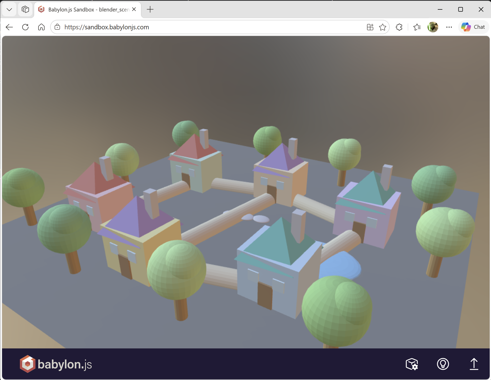

# Blender Scene Agent

An AI agent that creates and manipulates 3D scenes in a headless Blender instance running inside Docker. Built with the **Microsoft Agent Framework** and **Azure AI Foundry**, it communicates with Blender via the [BlenderMCP](https://github.com/ahujasid/blender-mcp) TCP socket protocol.

## Architecture

```
┌────────────────────────────────────────────────────────────────┐
│  Docker Container                                                │
│                                                                  │
│  ┌──────────┐    ┌──────────────────┐    ┌──────────────────┐    │
│  │  Xvfb    │◄───│  Blender 4.2     │    │  Python Agent    │    │
│  │ :99      │    │  (background)    │◄──►│  Server          │    │
│  │ virtual  │    │                  │TCP │                  │    │
│  │ display  │    │  blender_startup │9876│  main.py  :8088  │    │
│  └──────────┘    │  .py (socket     │    │  (Responses API) │    │
│                  │   server)        │    │                  │    │
│                  │                  │    │  voice_pipeline  │    │
│                  │                  │    │  .py      :8089  │    │
│                  └──────────────────┘    │  (voice WS)      │    │
│                                          └────┬────────┬────┘    │
│                                               │        │         │
└───────────────────────────────────────────────┼────────┼────────┘
                                          HTTPS  │        │  STT/TTS
                                   ┌─────────────▼───┐  ┌─▼──────────────────┐
                                   │  Azure AI       │  │  Azure Speech /    │
                                   │  Foundry        │  │  AI Services       │
                                   │  (GPT model)    │  │  (speech-in/out)   │
                                   └─────────────────┘  └────────────────────┘
```

The voice server is optional (see [Voice](#voice-speech-in--speech-out)): it
transcribes microphone audio with Azure Speech, routes the transcript through the
*same* agent turn as text (so voice and text share one server-side Blender scene),
and streams the spoken reply back as 24 kHz PCM.

## Features

- **Create 3D objects**: Cubes, spheres, cylinders, cones, torus, planes, monkeys
- **Apply materials**: Hex colors with metallic/roughness control
- **3D model library** — the agent can search Microsoft's public 3D-model service (`list_available_models`) and return a clickable thumbnail gallery in the chat. Click a thumbnail (or ask in natural language) and the agent imports that GLB into the Blender scene (`download_model`) and screenshots the result.
- **Poly Haven textures** — the agent can search [Poly Haven](https://polyhaven.com/) for free PBR surface textures (`list_available_textures`) and return a clickable gallery; pick one and name an object and it applies the texture as a material (`apply_texture`).
- **Viewport screenshots**: Capture and return the current viewport as base64 PNG
- **Full render**: Render scenes with EEVEE or Cycles engines
- **Voice (speech-in / speech-out)**: Optional push-to-talk voice powered by Azure Speech; shares the same server-side Blender scene as text chat
- **Arbitrary code execution**: Run custom Blender Python code for advanced operations
- **Per-VM Blender scene persistence**: Each Foundry micro-VM owns a single Blender scene, saved/restored from `$HOME` across idle resumes

## Files

| File | Purpose |
|------|---------|
| `main.py` | Agent server with 13 tool functions, Azure AI Foundry client |
| `voice_pipeline.py` | Optional voice server: Azure Speech STT/TTS over the `invocations_ws` WebSocket (port 8089), routing speech through the same agent turn as text |
| `blender_startup.py` | Blender addon (runs inside Blender) - TCP socket server on port 9876 |
| `blender_connection.py` | TCP client module used by the agent to talk to Blender |
| `scene_manager.py` | Single-scene-per-VM Blender persistence on `$HOME` |
| `entrypoint.sh` | Docker entrypoint: starts Xvfb, Blender, then Agent server |
| `agent.yaml` | Agent metadata and environment variable declarations |
| `Dockerfile` | Ubuntu 22.04 + Blender 4.2 + Python deps |

## Prerequisites

- Docker
- An Azure AI Foundry project with a deployed model (e.g., `gpt-4.1-mini`)
- Azure credentials configured (e.g., `az login`)
- The principal that runs the agent must have the **Storage Blob Data Contributor** *and* **Storage Blob Delegator** roles on the storage account. The first lets it upload/download blobs; the second is required by `get_user_delegation_key` to mint the SAS URLs returned to the user. The principal is:
  - **Local development:** your own Azure account (the one used with `az login`).
  - **Hosted in Azure AI Foundry (ADC, current platform):** a per-agent service identity automatically provisioned by Foundry, named `<foundry>-<project>-<agent>-AgentIdentity` (type `ServiceIdentity`). **This is not the Foundry project's managed identity** — it is a separate principal created for each agent. See [step 2](#2-assign-the-storage-blob-data-contributor-role) below for how to find its object ID and grant the roles.

## Setup for your own Azure environment

### 1. Create an Azure Blob Storage account and container

The agent uploads viewport screenshots and rendered images to Azure Blob Storage so they can be returned as URLs to the user (see the `upload_image_to_blob` function in `main.py`). The container used is called **`screenshots`**.

Create a storage account (or use an existing one):

```bash
az storage account create \
  --name <your-storage-account-name> \
  --resource-group <your-resource-group> \
  --location <your-location> \
  --sku Standard_LRS \
  --allow-blob-public-access true
```

Then **pre-create both containers** (the agent does not create them at runtime):

```bash
az storage container create --account-name <your-storage-account-name> --auth-mode login --name screenshots
az storage container create --account-name <your-storage-account-name> --auth-mode login --name blender-scenes
```

### 2. Assign the Storage Blob Data Contributor role

The agent authenticates to Blob Storage using `DefaultAzureCredential`. Two roles are required on the storage account:

- **`Storage Blob Data Contributor`** — read/write/delete blobs (screenshots, `.blend` scene files).
- **`Storage Blob Delegator`** — mint user-delegation SAS tokens (the agent returns SAS URLs for screenshots; without this role the upload succeeds but the URL is unusable).

#### 2a. Hosted in Azure AI Foundry (ADC platform)

Since the migration from ACA to ADC, Foundry runs each agent under its own auto-provisioned **service identity** — *not* the Foundry project's managed identity. The identity is named `<foundry>-<project>-<agent>-AgentIdentity` and only has `Azure AI User` on the project by default. **Any RBAC you previously granted to your own user-assigned MI on ACA does not carry over and must be re-granted to this new principal.**

To discover the object ID of the agent identity, the easiest way is to deploy the agent once and let it log the principal at first use — [main.py](main.py) calls `_log_storage_principal_once()` on the first blob upload, which prints a line like:

```
INFO: blender_agent: Storage MSI principal: oid=<GUID> appid=<GUID> tid=<GUID> ...
```

Alternatively, list it directly:

```bash
az ad sp list --display-name "<foundry-resource>-<project>-<agent>-AgentIdentity" --query "[].{displayName:displayName,id:id,appId:appId}" -o table
```

Then grant both roles:

```bash
OID=<object-id-of-the-AgentIdentity>
SCOPE=/subscriptions/<subscription-id>/resourceGroups/<resource-group>/providers/Microsoft.Storage/storageAccounts/<your-storage-account-name>

az role assignment create \
  --assignee-object-id $OID \
  --assignee-principal-type ServicePrincipal \
  --role "Storage Blob Data Contributor" \
  --scope $SCOPE

az role assignment create \
  --assignee-object-id $OID \
  --assignee-principal-type ServicePrincipal \
  --role "Storage Blob Delegator" \
  --scope $SCOPE
```

Verify:

```bash
az role assignment list --assignee $OID --all -o table
```

The output must show both `Storage Blob Data Contributor` and `Storage Blob Delegator`. **Allow ~30s–2 min for RBAC propagation** before testing image-generating prompts; until propagation completes, blob uploads will still return `AuthorizationPermissionMismatch`.

> **Least-privilege scope (optional).** The commands above scope both roles to the entire storage account. For tighter isolation, scope `Storage Blob Data Contributor` to a single container instead (the `Storage Blob Delegator` role must remain at the storage-account scope — user-delegation keys are minted at the account level):
>
> ```bash
> SCOPE_CONTAINER=/subscriptions/<sub>/resourceGroups/<rg>/providers/Microsoft.Storage/storageAccounts/<account>/blobServices/default/containers/screenshots
> ```

> **Recommended: codify the role assignments in IaC.** Add both role assignments to the Bicep/Terraform template that provisions the storage account, referencing the agent identity's principal ID as a parameter (not hard-coded). This prevents the 403 regression every time the agent is redeployed to a new environment or the agent identity is recreated by Foundry.

#### 2b. Local development

Assign the same two roles to your own Azure account:

```bash
az role assignment create \
  --assignee <your-azure-account-email-or-object-id> \
  --role "Storage Blob Data Contributor" \
  --scope /subscriptions/<subscription-id>/resourceGroups/<resource-group>/providers/Microsoft.Storage/storageAccounts/<your-storage-account-name>

az role assignment create \
  --assignee <your-azure-account-email-or-object-id> \
  --role "Storage Blob Delegator" \
  --scope /subscriptions/<subscription-id>/resourceGroups/<resource-group>/providers/Microsoft.Storage/storageAccounts/<your-storage-account-name>
```

#### Troubleshooting `AuthorizationPermissionMismatch`

If blob calls return HTTP 403 `AuthorizationPermissionMismatch` (different from `AuthorizationFailure`), it means the principal **has a token but the wrong role**. Check the logs for the `Storage MSI principal: oid=...` line and confirm that exact OID has both roles on the storage account scope. RBAC propagation can take 1–2 minutes.

### 3. Create your `.env` file

The repository ships a template, [`.env.example`](.env.example), that lists every
supported variable with placeholder values. **Never commit a real `.env`** — it is
git-ignored because it holds resource IDs (and optionally secrets) specific to your
subscription.

Copy the template and fill in your values:

```bash
cp .env.example .env
```

Then edit `.env`. At minimum, set the three required variables:

```env
PROJECT_ENDPOINT=https://<your-foundry-resource>.services.ai.azure.com/api/projects/<your-project-name>
MODEL_DEPLOYMENT_NAME=gpt-4.1-mini
AZURE_STORAGE_ACCOUNT_NAME=<your-storage-account-name>
```

| Variable | Required | Description |
|----------|----------|-------------|
| `PROJECT_ENDPOINT` | Yes | The full endpoint URL of your Azure AI Foundry project |
| `MODEL_DEPLOYMENT_NAME` | Yes | The name of the model deployment to use (e.g., `gpt-4.1-mini`) |
| `AZURE_STORAGE_ACCOUNT_NAME` | Yes | The name of the Azure Storage account created in step 1 |

To enable voice, also fill in `SPEECH_REGION` and `SPEECH_RESOURCE_ID` (see
[Environment Variables](#environment-variables) and
[Voice (speech-in / speech-out)](#voice-speech-in--speech-out) below). All other
variables are optional and documented inline in [`.env.example`](.env.example).

## Deploying to Azure AI Foundry

> ⚠️ **Set `AI_FOUNDRY_ACR_BUILD_WAIT_UNTIL_DONE=true` before deploying.**
>
> This agent's Docker image installs Blender (and its system dependencies), which makes the Azure Container Registry build noticeably long. Without this flag, the Foundry deploy command may return a timeout while the ACR build is still running, leaving you unsure whether the deployment succeeded. Setting it forces the deploy tooling to wait until the ACR build actually finishes.
>
> Set it in the **shell from which you launch the deployment** (not inside the container):
>
> **PowerShell**
> ```powershell
> $env:AI_FOUNDRY_ACR_BUILD_WAIT_UNTIL_DONE = "true"
> ```
>
> **bash / zsh**
> ```bash
> export AI_FOUNDRY_ACR_BUILD_WAIT_UNTIL_DONE=true
> ```

## Build & Run

### Build the Docker image

```bash
docker build -t blender-scene-agent .

docker build --platform linux/amd64 --no-cache -t blender-scene-agent .    
```

### Run the container

The container exposes **two** ports, so publish both when running locally:

- **`8088`** — the agent's HTTP endpoint (`/responses`, health, etc.).
- **`8089`** — the voice WebSocket endpoint (`/invocations_ws`) used for speech-in / speech-out. If you omit `-p 8089:8089`, text chat still works but voice will fail to connect.

> If you run with `ENABLE_VOICE=false` (or without Speech configured), the voice server doesn't start and publishing `8089` is optional.

```bash
docker run -it --rm \
  -p 8088:8088 \
  -p 8089:8089 \
  -e PROJECT_ENDPOINT="https://your-project.services.ai.azure.com/api/projects/your-project-id" \
  -e MODEL_DEPLOYMENT_NAME="gpt-4.1-mini" \
  -e AZURE_CLIENT_ID="..." \
  -e AZURE_TENANT_ID="..." \
  -e AZURE_CLIENT_SECRET="..." \
  blender-scene-agent
```

#### macOS / Linux

```bash
docker run -it --rm -p 8088:8088 -p 8089:8089 \
  --env-file .env \
  -v ~/.azure:/root/.azure:ro \
  blender-scene-agent
```

#### Windows (PowerShell)

```powershell
docker run -it --rm -p 8088:8088 -p 8089:8089 --env-file .env -v ~/.azure:/root/.azure:ro blender-scene-agent
```

If the container can't read your Azure credentials (you'll see a `DefaultAzureCredential` error at startup), it's because the Azure CLI on Windows encrypts the token cache with DPAPI by default and a Linux container can't decrypt it. Run this once on your host to switch to a plaintext cache (same behaviour as macOS/Linux), then retry:

```powershell
az config set core.encrypt_token_cache=false
az account clear
az login
```

> **Security note:** tokens are then stored in plaintext in `%USERPROFILE%\.azure`. Re-enable later with `az config set core.encrypt_token_cache=true` if needed.

**Fallback** (no host changes): omit the `-v` mount and the container will fall back to `az login --use-device-code`:

```powershell
docker run -it --rm -p 8088:8088 -p 8089:8089 --env-file .env blender-scene-agent
```

Or mount Azure CLI credentials for local development (macOS/Linux):

```bash
docker run -it --rm \
  -p 8088:8088 \
  -p 8089:8089 \
  -e PROJECT_ENDPOINT="..." \
  -e MODEL_DEPLOYMENT_NAME="gpt-4.1-mini" \
  -v ~/.azure:/root/.azure:ro \
  blender-scene-agent
```

### Local development (without Docker)

1. Install dependencies: `pip install -r requirements.txt`
2. Start Blender with the socket server:
   ```bash
   blender --background --python blender_startup.py
   ```
3. In another terminal, run the agent:
   ```bash
   python main.py --port 8088
   ```

## Environment Variables

| Variable | Required | Default | Description |
|----------|----------|---------|-------------|
| `PROJECT_ENDPOINT` | Yes | - | Azure AI Foundry project endpoint |
| `MODEL_DEPLOYMENT_NAME` | No | `gpt-4.1-mini` | Deployed model name |
| `BLENDER_HOST` | No | `localhost` | Blender socket server host |
| `BLENDER_PORT` | No | `9876` | Blender socket server port |
| `ENABLE_VOICE` | No | `true` | Enable the voice path (speech-in / speech-out). Voice only activates when Speech is also configured below. |
| `SPEECH_REGION` | For voice | - | Azure Speech / AI Services region (e.g. `northcentralus`). |
| `SPEECH_RESOURCE_ID` | For voice (keyless) | - | Resource ID of the Speech / AI Services resource, used for keyless (AAD) auth. |
| `SPEECH_KEY` | Alt. to keyless | - | Speech resource key (only if not using keyless AAD auth). |
| `SPEECH_VOICE_NAME` | No | `en-US-NovaMultilingualNeuralHD` | Primary neural voice for TTS. |
| `SPEECH_VOICE_FALLBACK` | No | `en-US-AvaMultilingualNeural` | Fallback voice if the primary is throttled/unavailable. |
| `VOICE_WS_PORT` | No | `8089` | Port for the voice WebSocket (`invocations_ws`). |

### Voice (speech-in / speech-out)

The agent optionally exposes a **voice WebSocket** (`invocations_ws` protocol,
port `8089`) alongside the text Responses API. Microphone audio is transcribed
with Azure Speech STT, sent through the *same* agent turn (so voice and text
share one server-side Blender scene keyed by `conversation_id`), and the spoken
reply is streamed back as 24 kHz PCM. Screenshots, renders, and download links
are never read aloud — instead a short spoken cue announces them while the image
or download button still renders in the web chat.

The voice path is **fully optional**: if `ENABLE_VOICE` is off or Speech is not
configured, the agent runs text-only and the voice server never starts.

**Keyless auth (recommended):** grant the agent's Entra identity the
`Cognitive Services User` (or `Cognitive Services Speech User`) role on the
Speech / AI Services resource, and deploy the agent in the same region
(e.g. `northcentralus`). Set `SPEECH_REGION` and `SPEECH_RESOURCE_ID`.

**Run locally with voice:**

```bash
az login
export ENABLE_VOICE=true
export SPEECH_REGION=northcentralus
export SPEECH_RESOURCE_ID="/subscriptions/<sub>/resourceGroups/<rg>/providers/Microsoft.CognitiveServices/accounts/<name>"
python main.py --port 8088
# → "Voice WebSocket listening on ws://0.0.0.0:8089/invocations_ws"
```

Then start the web chat (`webchat/`) with `VOICE_ENABLED=true` and hold the 🎙️
mic button to talk.


## Agent Tools

| Tool | Description |
|------|-------------|
| `get_scene_info` | List all objects in the current scene |
| `get_object_info` | Get details about a specific object |
| `create_object` | Create a primitive (cube, sphere, etc.) |
| `modify_object` | Change location, rotation, or scale |
| `delete_object` | Remove an object from the scene |
| `apply_material` | Apply a colored material with metallic/roughness |
| `execute_blender_code` | Run arbitrary Python code in Blender |
| `get_viewport_screenshot` | Capture the 3D viewport as PNG |
| `list_available_models` | Search Microsoft's 3D-model library (returns a clickable gallery) |
| `download_model` | Import a chosen GLB model from the library into the scene |
| `list_available_textures` | Search Poly Haven for free PBR textures (returns a clickable gallery) |
| `apply_texture` | Download a Poly Haven texture and apply it to an object |
| `setup_scene` | Initialize camera, lighting, and ground plane |
| `render_scene` | Render the scene with EEVEE or Cycles |
| `save_scene_for_download` | Save the scene as a .blend file and return a download link (expires after 1 hour) |

## Demos prompts

- "Find a table in the model library, add it to the center, create 12 metallic cubes of various colors around it and share a high fidelity rendering of the result"
- "Add a plastic yellow sphere on top of the table"


- Create a fantasy world for kids, use basic primitives to build 6 houses and 10 trees. A kid should later be able to navigate in this 3D world on a path connecting each house. Give me a high fidelity rendering at the end
- give me the GLB version

Then, drag'n'drop the GLB file in https://sandbox.babylonjs.com for instance



## Scene Persistence

The agent persists a single Blender scene per Foundry micro-VM, restored across idle/resume cycles. This is handled by `SceneIsolationMiddleware` (in `main.py`) and `SceneManager` (in `scene_manager.py`).

### How it works

On Azure AI Foundry's ADC platform each agent runs inside its own micro-VM, bound 1:1 to a logical conversation. The VM is paused after ~15 minutes of inactivity and resumed on the next request, preserving `$HOME` on disk but wiping process memory (including the Blender process itself and the Agent Framework's in-memory session repository).

Given that 1:1 binding, the agent does **not** try to multiplex multiple conversations onto one container. It keeps exactly one scene file at `$HOME/blender_scenes/scene.blend`:

1. **First turn of a fresh VM.** No `scene.blend` on disk → middleware resets Blender to a clean scene.
2. **Subsequent turns in the same VM (active).** Blender is still running and holds the scene in memory. The middleware re-saves to `scene.blend` after each streaming response so an idle pause from this turn onwards is recoverable.
3. **Resume after idle.** Blender process is gone; `scene.blend` is on disk. The middleware waits for the supervisor to bring Blender back up, then loads `scene.blend` into the fresh Blender instance.

Azure Blob Storage is **not** used for the `.blend` scene file (that data is local to the VM, persisted by the platform). Blob storage is only used for two distinct flows: (a) screenshots/renders the agent surfaces back to the chat client, and (b) one-off `.blend` / `.glb` download links the user can save off-platform. **Both the `screenshots` and `blender-scenes` containers must be pre-created** — the agent no longer creates them at runtime (least-privilege RBAC on the Foundry agent identity does not include management-plane permissions).

### Conversation ID — telemetry only

The middleware still resolves a conversation id (`SceneIsolationMiddleware._get_conversation_id`, preferring a stable Foundry `conv_xxx`, then client-supplied `conversation_id`, then headers, then `context.session.session_id`) but it is used **only for logging and the persisted state file's `last_conversation_id` field**. Because the scene file is no longer keyed by it, a volatile/regenerated id across an idle/resume cycle is harmless — the scene is found by its fixed filename either way.

## Idle vs Active: why this agent needs a special lifecycle

Most AI agents hosted on Azure AI Foundry are stateless: each turn talks to a model and returns text. Our agent is different — it **owns a long-running, stateful Blender process** that holds the user's 3D scene entirely in memory. That single fact makes the Foundry hosting model's idle/active behavior load-bearing for us in a way that doesn't matter to a typical agent.

### The Foundry micro-VM hosting model in one paragraph

Foundry's Hosting Agent platform runs each agent inside an isolated micro-VM, scaled to zero between active uses. After ~15 minutes without traffic, the micro-VM is **paused** ("idle"). When the next request arrives, it is **resumed** ("active") in a few seconds. From the operating system's point of view this is closer to a laptop suspend/resume than to a fresh container start: most files on disk are preserved, but anything in-memory (or in non-persistent filesystem regions) is **not** guaranteed across the boundary.

For a stateless agent this is invisible. For us it would be catastrophic — a paused Blender process does not resume cleanly when the VM thaws, and any conversational state that lived only in Python memory is gone.

### What persists, what doesn't

| Storage region | Persisted across idle? | Used for |
|---|---|---|
| `$HOME` (`/root`) — files | ✅ Yes | `.blend` scene snapshots, `.blender_session_state` JSON marker |
| `/tmp` — files | ⚠️ Sometimes (observed to survive on ADC; **do not rely on it for state, but DO clean stale locks on every boot**) | Xvfb display lock (`/tmp/.X99-lock`), socket file (`/tmp/.X11-unix/X99`) — stale copies are deadly if reused |
| Process memory (Blender, agent server) | ❌ No | Live Blender scene, Python globals, supervisor PIDs |
| TCP sockets (port 9876 to Blender) | ❌ No | The agent must reconnect on resume |
| `InMemoryAgentSessionRepository` | ❌ No | Agent Framework session state (including `session_id`) — wiped on every resume |

That last row is mostly diagnostic now: because the scene file is stored under a fixed filename (`$HOME/blender_scenes/scene.blend`) rather than keyed by `session_id`, a regenerated `AgentSession` after resume no longer threatens scene continuity. It used to — see the playbook at the end of this section.

### Two failure modes we explicitly defend against

1. **Stale Xvfb lock files in `/tmp`.** When the VM resumes, `Xvfb :99` is no longer running but `/tmp/.X99-lock` and `/tmp/.X11-unix/X99` may still exist. Every restart attempt then fails with `Server is already active for display 99`, Blender exits with `GHOST: failed to initialize display`, and the supervisor retries forever. **Fix:** `entrypoint.sh::start_xvfb` always runs `pkill -9 -f "Xvfb :99"` and `rm -f` on both lock files *before* starting Xvfb.
2. **Premature scene activation while Blender is still booting.** On resume the supervisor needs ~2–3 seconds to bring Xvfb and Blender back up. If the first request lands inside that window, `activate_scene` will try to load the persisted `.blend` while the socket is still refused, fall back to a clean scene, and silently destroy the user's work. **Fix:** before activation, the middleware runs `is_blender_socket_ready(timeout=1.0)`. If false, it `await`s `_wait_for_blender(120)` *before* touching the scene — the user is informed via streamed status messages while they wait.

### The persisted state file `$HOME/.blender_session_state`

To distinguish a **cold start** (fresh container, no previous work) from an **idle resume** (state to recover), `entrypoint.sh` reads and rewrites a small JSON marker at boot:

```json
{
  "blender_ready": false,
  "needs_scene_reload": true,
  "session_started_at": "2026-05-13T10:36:58Z",
  "last_conversation_id": "8f8bf402-1ec2-422a-8e05-b9b1dac40aa4",
  "last_saved_at": "2026-05-13T10:15:18Z"
}
```

- **First boot ever** (file does not exist): `needs_scene_reload=false` — there's nothing to restore. `entrypoint.sh` also exports `BLENDER_COLD_START=1` so the middleware can suppress the misleading "🔄 restarting after being paused" message during the natural ~3s startup delay.
- **Resume from idle** (file already exists): `needs_scene_reload=true` is preserved; `blender_ready=false` is rewritten to signal the boot is in progress; `BLENDER_COLD_START=0`.
- The agent flips `blender_ready=true` once it has reconnected to Blender (`SceneManager.set_blender_ready`), and writes `last_conversation_id` + `last_saved_at` after every successful `save_scene` (telemetry/diagnostics only — they are no longer used to locate the scene file).

The file is the *only* signal we have at process start to tell us whether the container has run before. We update it atomically (write to a temp file then `os.replace`) and tolerate missing/corrupt JSON by treating it as "no state".

### What the user actually sees on resume

The middleware builds a `recovery_messages` list during the ACTIVATE phase and yields each entry as a streamed `AgentResponseUpdate` *before* the model starts emitting tokens, so the chat client shows something like:

```
🔄 The Blender engine is restarting after being paused. Please hold on while
   the supervisor brings it back up…

📂 Loaded your most recent scene (created in a previous session) — restoring it now.

✅ Blender is ready — loading your scene…

<model answer follows>
```

(Each line corresponds to one decision in the middleware. The 🔄 line is suppressed on `BLENDER_COLD_START=1`; the 📂 line is yielded whenever `scene.blend` is present on disk, which is every turn after the first one in a given micro-VM.)

### Why this is unusual

A typical Foundry agent doesn't need any of this. It's only required because we are doing something the platform isn't optimised for out of the box: **co-hosting a long-lived native process (Blender) inside the agent container**, owning its scene state in memory, and exposing it through a TCP socket that the agent process talks to. The combination of (a) external stateful process and (b) micro-VM suspend/resume that doesn't preserve that process is what forces the persisted-state-file + cold-start-flag + socket-probe design above.

If you are building a new agent that wraps any similarly stateful native dependency on Foundry — a database engine, a game engine, a long-running compute kernel — this section is the playbook. The four invariants worth copying are:

1. **Clean every transient resource on boot, don't trust the OS to have done it for you.** (Xvfb locks, named pipes, PID files.)
2. **Treat `$HOME` as the canonical state store and write a JSON marker that distinguishes cold start from resume.**
3. **Lean on the platform's 1:1 binding between micro-VM and conversation — don't multiplex.** Earlier iterations of this agent keyed the scene file by `conversation_id` and had to invent an orphan-adoption rescue for the case where the in-memory `session_id` was regenerated across resume. On Foundry's ADC platform that complexity is unnecessary: one VM = one logical conversation, so one fixed-name scene file per VM is both simpler and more robust. Reserve client-supplied/Foundry stable ids for telemetry, not as state keys.
4. **Probe your external dependency before touching it on the first request after resume, and stream a user-visible status message while you wait** — the alternative is a silently corrupted user experience.

## Middleware

The agent is wired with two custom middlewares that sit on top of the Microsoft Agent Framework:

```python
middleware=[SceneIsolationMiddleware(ToolStatusMiddleware(), scene_manager)],
```

The outer one runs first on the way in and last on the way out; the inner one sits closest to the LLM and tool execution. Together they add capabilities the framework does not provide on its own.

### `SceneIsolationMiddleware` (outer)

Provides **per-VM Blender scene persistence** on top of a single shared Blender process. On Foundry's ADC platform each agent runs in a micro-VM bound 1:1 to a conversation, so the middleware keeps exactly one scene file (`$HOME/blender_scenes/scene.blend`) per container lifetime:

- **Conversation ID resolution (telemetry only)** — prefers a stable Foundry `conv_xxx` id discovered on `context.session` / `context.agent`, then the client-supplied `conversation_id` from `context.options` / `context.kwargs` / `context.metadata`, then `agent._request_headers["conversation_id"]`, then `context.session.session_id`. The resolved value is logged and written to the persisted state file's `last_conversation_id` field, but **the scene file is not keyed by it** — a regenerated session id across an idle/resume cycle is harmless.
- **Activate before the run** — first runs a non-retrying socket probe against Blender. If the socket is refused, waits for the supervisor to bring Blender back up (cold start vs. idle resume distinguished via the `BLENDER_COLD_START` env var written by `entrypoint.sh`) and streams `🔄`/`✅` status messages to the user. Then loads `scene.blend` if it exists, else resets Blender to a clean scene.
- **Save after streaming completes** — wraps `context.result` in a generator with a `finally` block so the scene is saved to `$HOME/blender_scenes/scene.blend` *after* the last chunk is yielded. The wrapper also yields any pending `recovery_messages` from the ACTIVATE phase before the model's first token.

### `ToolStatusMiddleware` (inner)

Transforms the raw streaming response into a richer UX stream for the WebChat client:

- **Human-readable status pills** — when a `FunctionCallContent` chunk is seen for a tool such as `render_final` or `download_model`, an extra status message ("Rendering the final image…", "Importing the 3D model…") is emitted via the `_TOOL_STATUS_MESSAGES` map. Without this the user just sees a long pause while a tool runs.
- **Deduplication** — the framework can emit multiple `FunctionCallContent` chunks with different `call_id`s for one logical invocation; a per-turn `announced_names` set ensures only one pill per tool.
- **Early image surfacing** — for image-producing tools (`get_viewport_screenshot`, `render_preview`, `render_final`) the markdown image is pulled out of the tool result and streamed immediately, instead of waiting for the model to echo it in its final answer.
- **Early download-link surfacing** — same treatment for `save_scene_for_download` and `export_scene_as_glb_for_download`.
- **Heartbeats and per-turn timeout** — a background pump task feeds chunks into a queue so heartbeat messages can be interleaved without cancelling an in-flight HTTP read; if the turn exceeds `TURN_TIMEOUT_SECONDS`, a friendly timeout message is yielded instead of a raw exception.
- **Friendly error mapping** — on upstream stream failures, structured diagnostics (session id, elapsed ms, status code, request id, exception type) are logged and a friendly model-error message is yielded to the user before the exception is re-raised for telemetry.

### Why this composition order

`SceneIsolation` *outside* `ToolStatus` is deliberate: scene activation must happen *before* any tool runs, and scene save must happen *after* the entire streamed response (including status messages and surfaced images) has been delivered to the client.

| Concern | Provided by |
|---|---|
| Per-VM persistence of an external stateful process (Blender) | `SceneIsolationMiddleware` |
| Loading/saving that state on disk at the right point in the request lifecycle | `SceneIsolationMiddleware` |
| Resolving conversation IDs (for telemetry) across local agentdev vs. Foundry routing quirks | `SceneIsolationMiddleware` |
| Tool-call → user-facing status messages | `ToolStatusMiddleware` |
| Streaming images / download links the moment the tool returns them | `ToolStatusMiddleware` |
| Heartbeats and per-turn timeout with friendly fallback text | `ToolStatusMiddleware` |
| Structured diagnostics on stream failure | `ToolStatusMiddleware` |

## Credits

- [BlenderMCP](https://github.com/ahujasid/blender-mcp) by Siddharth Ahuja - TCP socket protocol
- [Poly Haven](https://polyhaven.com/) - Free HDRIs, textures, and 3D models
- [Microsoft Agent Framework](https://github.com/microsoft/agent-framework) - Agent-as-Server pattern
