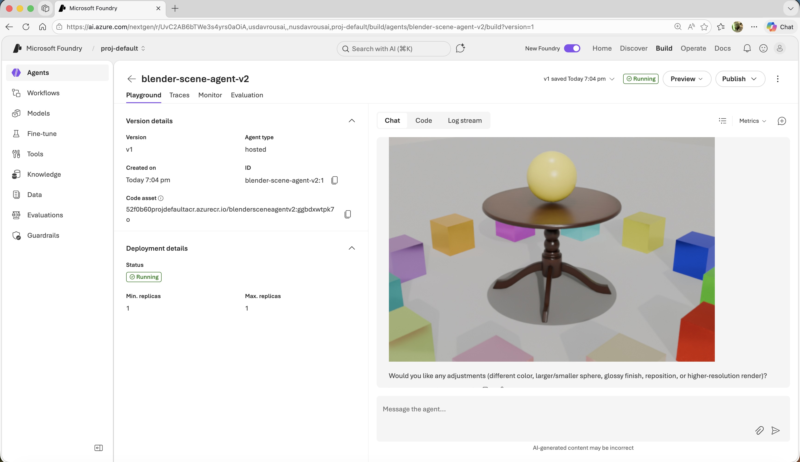
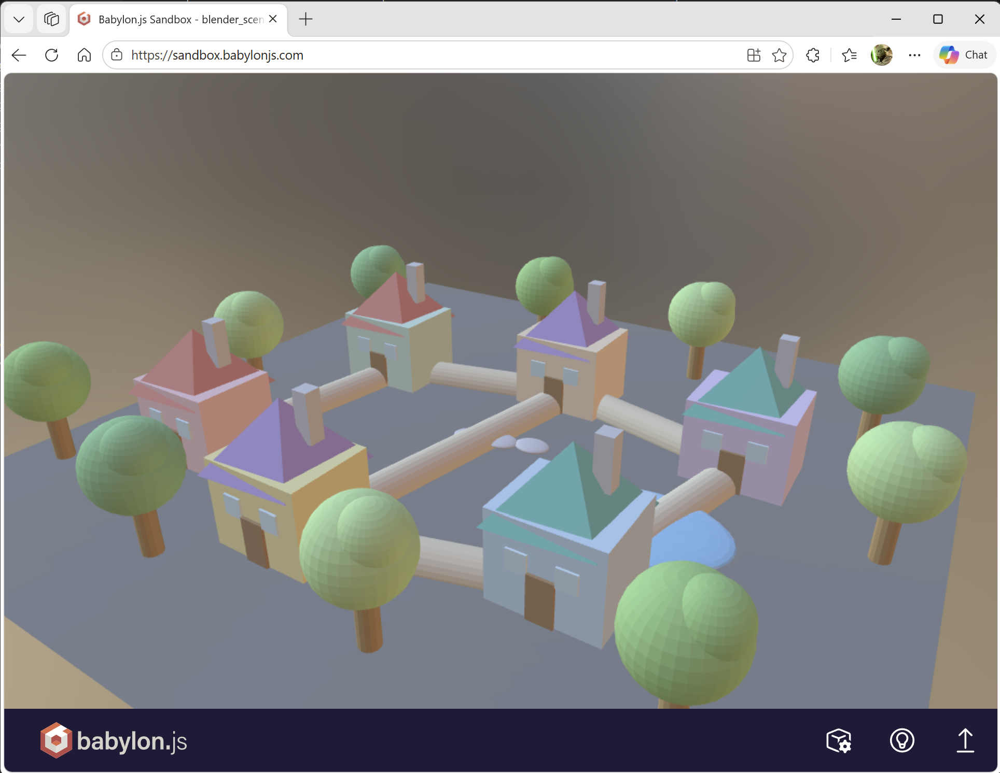
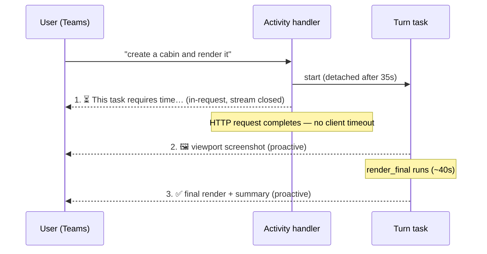

# Blender Scene Agent

An AI agent that creates and manipulates 3D scenes in a headless Blender instance running inside Docker. Built with the **Microsoft Agent Framework** and **Azure AI Foundry**, it communicates with Blender via the [BlenderMCP](https://github.com/ahujasid/blender-mcp) TCP socket protocol.

Build scenes from text or visual references, inspect and download 3D assets, render
still images or camera animations, and optionally finish a clay video with Seedance.
Use the custom Webchat, Teams, or voice for scene-building turns.

**Reading Path**

1. **Explore:** [Features](#features) and [Demo Prompts](#demo-prompts).
2. **Get running:** [Prerequisites](#prerequisites), [Azure Setup](#setup-for-your-own-azure-environment), then [Build & Run](#build--run). [Hosted deployment](#deploying-to-azure-ai-foundry) is a separate, optional step.
3. **Use the agent:** [Webchat](webchat/README.md), [Teams](#teams-setup-and-usage), [Voice](#voice-speech-in--speech-out), then [Video and Seedance](#reference-to-video-workflow).
4. **Configure and verify:** [Environment Variables](#environment-variables), [Agent Tools](#agent-tools), and [Verification](#video-verification).
5. **Understand and troubleshoot:** [Architecture](#architecture), [Persistence](#scene-persistence), [Job Recovery](#jobs-and-recovery), and [Middleware](#middleware), followed by protocol internals, local debugging and diagnostics.

To see what the agent can do, watch this video:

[](https://youtu.be/tQ2BpvhCu2g?si=SOtc85sbMr8lIDNz)

## Features

- **Create 3D objects**: Cubes, spheres, cylinders, cones, torus, planes, monkeys
- **Apply materials**: Hex colors with metallic/roughness control
- **3D model library** — the agent can search Microsoft's public 3D-model service (`list_available_models`) and return a clickable thumbnail gallery in the chat. Click a thumbnail (or ask in natural language) and the agent imports that GLB into the Blender scene (`download_model`) and screenshots the result.
- **Poly Haven textures** — the agent can search [Poly Haven](https://polyhaven.com/) for free PBR surface textures (`list_available_textures`) and return a clickable gallery; pick one and name an object and it applies the texture as a material (`apply_texture`).
- **Viewport screenshots**: Capture the current viewport and return a Blob-hosted PNG preview
- **Full render**: Render scenes with EEVEE or Cycles engines
- **3D export and preview**: Download `.blend` or `.glb` files; inspect exported GLBs in the Webchat's Babylon.js viewer
- **Reference analysis**: Upload images or MP4 clips in Webchat or Teams for approximate scene layout and camera-motion planning
- **Camera animation and video**: Render short standard-material or neutral clay MP4s from an isolated scene snapshot, preserving the working scene's materials
- **Optional Seedance finishing**: Prepare a clay preview, inspect it, then explicitly approve paid external processing through the job controls
- **Live video jobs**: Webchat polls progress and restores saved jobs; Teams updates the same Adaptive Card in place, with Status recovery and signed downloads
- **Voice (speech-in / speech-out)**: Optional push-to-talk voice powered by Azure Speech; shares the same server-side Blender scene as text chat
- **Teams / M365 Copilot (Activity protocol)**: The container serves the Activity protocol natively alongside `responses`, so the agent's custom waiting messages appear as live *informative updates* in Teams instead of a generic "working on it" indicator
- **Arbitrary code execution**: Run custom Blender Python code for advanced operations
- **Per-VM Blender scene persistence**: Each Foundry micro-VM owns a single Blender scene, saved/restored from `$HOME` across idle resumes
- **Long-running turns**: Activity-aware idle and absolute timeouts, Webchat elapsed-status updates, and proactive delivery for slow Teams turns

## Demo Prompts

- "Find a table in the model library, add it to the center, create 12 metallic cubes of various colors around it and share a high fidelity rendering of the result"
- "Add a plastic yellow sphere on top of the table"



- Create a fantasy world for kids, use basic primitives to build 6 houses and 10 trees. A kid should later be able to navigate in this 3D world on a path connecting each house. Give me a high fidelity rendering at the end
- give me the GLB version

Then, drag'n'drop the GLB file in https://sandbox.babylonjs.com for instance



## Prerequisites

- Docker
- An Azure AI Foundry project with a deployed model (e.g., `gpt-4.1-mini`); reference analysis requires image input and structured-output support
- Azure credentials configured (e.g., `az login`)
- The principal that runs the agent must have the **Storage Blob Data Contributor** *and* **Storage Blob Delegator** roles on the storage account. The first lets it upload/download blobs; the second is required by `get_user_delegation_key` to mint the SAS URLs returned to the user. The principal is:
  - **Local development:** your own Azure account (the one used with `az login`).
  - **Hosted in Azure AI Foundry (ADC, current platform):** a per-agent service identity automatically provisioned by Foundry, named `<foundry>-<project>-<agent>-AgentIdentity` (type `ServiceIdentity`). **This is not the Foundry project's managed identity** — it is a separate principal created for each agent. See [step 2](#2-assign-the-storage-blob-data-contributor-role) below for how to find its object ID and grant the roles.

## Setup for your own Azure environment

### 1. Create an Azure Blob Storage account and container

The agent uploads viewport screenshots and rendered images to Azure Blob Storage so they can be returned as URLs to the user (see the `upload_image_to_blob` function in `main.py`). The container used is called **`screenshots`**.

Create a storage account (or use an existing one):

```bash
az storage account create \
  --name <your-storage-account-name> \
  --resource-group <your-resource-group> \
  --location <your-location> \
  --sku Standard_LRS \
  --allow-blob-public-access false
```

Then **pre-create the private `screenshots` container** (the agent does not create it
at runtime; the provisioning identity needs Blob data permissions):

```bash
az storage container create --account-name <your-storage-account-name> --auth-mode login --name screenshots
```

This one container holds image/export artifacts, references and video jobs in separate
namespaces. A `blender-scenes` container is no longer required. The working scene
and render snapshots are stored under `$HOME`, not in Blob storage. Existing containers
must also be private; the Webchat upload service rejects public containers.

### 2. Assign the Storage Blob Data Contributor role

The agent authenticates to Blob Storage using `DefaultAzureCredential`. Two roles are required on the storage account:

- **`Storage Blob Data Contributor`**: read/write/delete artifacts, references and job manifests, including optional `.blend` downloads.
- **`Storage Blob Delegator`** — mint user-delegation SAS tokens (the agent returns SAS URLs for screenshots; without this role the upload succeeds but the URL is unusable).

#### 2a. Hosted in Azure AI Foundry (ADC platform)

Since the migration from ACA to ADC, Foundry runs each agent under its own auto-provisioned **service identity** — *not* the Foundry project's managed identity. The identity is named `<foundry>-<project>-<agent>-AgentIdentity` and only has `Azure AI User` on the project by default. **Any RBAC you previously granted to your own user-assigned MI on ACA does not carry over and must be re-granted to this new principal.**

To discover the object ID of the agent identity, the easiest way is to deploy the agent once and let it log the principal at first use — [main.py](main.py) calls `_log_storage_principal_once()` on the first blob upload, which prints a line like:

```
INFO: blender_agent: Storage MSI principal: oid=<GUID> appid=<GUID> tid=<GUID> ...
```

Alternatively, list it directly:

```bash
az ad sp list --display-name "<foundry-resource>-<project>-<agent>-AgentIdentity" --query "[].{displayName:displayName,id:id,appId:appId}" -o table
```

Then grant both roles:

```bash
OID=<object-id-of-the-AgentIdentity>
SCOPE=/subscriptions/<subscription-id>/resourceGroups/<resource-group>/providers/Microsoft.Storage/storageAccounts/<your-storage-account-name>

az role assignment create \
  --assignee-object-id $OID \
  --assignee-principal-type ServicePrincipal \
  --role "Storage Blob Data Contributor" \
  --scope $SCOPE

az role assignment create \
  --assignee-object-id $OID \
  --assignee-principal-type ServicePrincipal \
  --role "Storage Blob Delegator" \
  --scope $SCOPE
```

Verify:

```bash
az role assignment list --assignee $OID --all -o table
```

The output must show both `Storage Blob Data Contributor` and `Storage Blob Delegator`. **Allow ~30s–2 min for RBAC propagation** before testing image-generating prompts; until propagation completes, blob uploads will still return `AuthorizationPermissionMismatch`.

> **Least-privilege scope (optional).** The commands above scope both roles to the entire storage account. For tighter isolation, scope `Storage Blob Data Contributor` to a single container instead (the `Storage Blob Delegator` role must remain at the storage-account scope — user-delegation keys are minted at the account level):
>
> ```bash
> SCOPE_CONTAINER=/subscriptions/<sub>/resourceGroups/<rg>/providers/Microsoft.Storage/storageAccounts/<account>/blobServices/default/containers/screenshots
> ```

> **Recommended: codify the role assignments in IaC.** Add both role assignments to the Bicep/Terraform template that provisions the storage account, referencing the agent identity's principal ID as a parameter (not hard-coded). This prevents the 403 regression every time the agent is redeployed to a new environment or the agent identity is recreated by Foundry.

#### 2b. Local development

Assign the same two roles to your own Azure account:

```bash
az role assignment create \
  --assignee <your-azure-account-email-or-object-id> \
  --role "Storage Blob Data Contributor" \
  --scope /subscriptions/<subscription-id>/resourceGroups/<resource-group>/providers/Microsoft.Storage/storageAccounts/<your-storage-account-name>

az role assignment create \
  --assignee <your-azure-account-email-or-object-id> \
  --role "Storage Blob Delegator" \
  --scope /subscriptions/<subscription-id>/resourceGroups/<resource-group>/providers/Microsoft.Storage/storageAccounts/<your-storage-account-name>
```

#### Troubleshooting `AuthorizationPermissionMismatch`

If blob calls return HTTP 403 `AuthorizationPermissionMismatch` (different from `AuthorizationFailure`), it means the principal **has a token but the wrong role**. Check the logs for the `Storage MSI principal: oid=...` line and confirm that exact OID has both roles on the storage account scope. RBAC propagation can take 1–2 minutes.

### 3. Create your `.env` file

The repository ships a template, [`.env.example`](.env.example), that lists every
common configuration variables with placeholder values. **Never commit a real `.env`** — it is
git-ignored because it holds resource IDs (and optionally secrets) specific to your
subscription.

Copy the template and fill in your values:

```bash
cp .env.example .env
```

Then edit `.env`. At minimum, set the three required variables:

```env
PROJECT_ENDPOINT=https://<your-foundry-resource>.services.ai.azure.com/api/projects/<your-project-name>
MODEL_DEPLOYMENT_NAME=gpt-4.1-mini
AZURE_STORAGE_ACCOUNT_NAME=<your-storage-account-name>
```

| Variable | Required | Description |
|----------|----------|-------------|
| `PROJECT_ENDPOINT` | Yes | The full endpoint URL of your Azure AI Foundry project |
| `MODEL_DEPLOYMENT_NAME` | Yes | The name of the model deployment to use (e.g., `gpt-4.1-mini`) |
| `AZURE_STORAGE_ACCOUNT_NAME` | Yes | The name of the Azure Storage account created in step 1 |

To enable voice, also fill in `SPEECH_REGION` and `SPEECH_RESOURCE_ID` (see
[Environment Variables](#environment-variables) and
[Voice (speech-in / speech-out)](#voice-speech-in--speech-out) below). All other
variables are optional or feature-specific. For reference uploads/video controls,
configure `MEDIA_CONTROL_SECRET`; for paid finishing, also configure
`WAVESPEED_API_KEY`. See [Video Configuration](#configuration) and the tables below.

## Build & Run

### The `blenderagent` script (recommended)

A small wrapper at the repo root wraps the `docker` and Playground commands below, so you don't have to remember the flags. Same verbs on both platforms:

| | macOS / Linux / Git Bash | Windows PowerShell |
| --- | --- | --- |
| Build the image | `./blenderagent rebuild` | `.\blenderagent.ps1 rebuild` |
| Run the container | `./blenderagent start` | `.\blenderagent.ps1 start` |
| Both, in order | `./blenderagent up` | `.\blenderagent.ps1 up` |
| Open the Agents Playground | `./blenderagent playground` | `.\blenderagent.ps1 playground` |

It runs from its own directory (so it works from anywhere), checks that `docker`, `.env` and `~/.azure` are present before doing anything, prints each command before running it, and passes anything after the verb straight through:

```bash
./blenderagent rebuild --no-cache
./blenderagent start -e LOG_LEVEL=DEBUG
```

`start` and `playground` are two separate long-running processes — run them in two terminals.

With the agent running, follow the [Webchat quickstart](webchat/README.md#quickstart--local-mode)
or open the Playground, then try a [demo prompt](#demo-prompts). You do not need a
hosted deployment to use the local container.

The remaining build/run subsections are alternatives for manual Docker commands or
development without Docker. Skip them if the wrapper is working for you.

### Build the Docker image

```bash
docker build -t blender-scene-agent .

docker build --platform linux/amd64 --no-cache -t blender-scene-agent .    
```

### Run the container

The container exposes **two** ports, so publish both when running locally:

- **`8088`** — the agent's HTTP endpoint (`/responses`, health, etc.).
- **`8089`** — the voice WebSocket endpoint (`/invocations_ws`) used for speech-in / speech-out. If you omit `-p 8089:8089`, text chat still works but voice will fail to connect.

> If you run with `ENABLE_VOICE=false` (or without Speech configured), the voice server doesn't start and publishing `8089` is optional.

```bash
docker run -it --rm \
  -p 8088:8088 \
  -p 8089:8089 \
  -e PROJECT_ENDPOINT="https://your-project.services.ai.azure.com/api/projects/your-project-id" \
  -e MODEL_DEPLOYMENT_NAME="gpt-4.1-mini" \
  -e AZURE_CLIENT_ID="..." \
  -e AZURE_TENANT_ID="..." \
  -e AZURE_CLIENT_SECRET="..." \
  blender-scene-agent
```

#### macOS / Linux

```bash
docker run -it --rm -p 8088:8088 -p 8089:8089 \
  --env-file .env \
  -v ~/.azure:/root/.azure:ro \
  blender-scene-agent
```

#### Windows (PowerShell)

```powershell
docker run -it --rm -p 8088:8088 -p 8089:8089 --env-file .env -v ~/.azure:/root/.azure:ro blender-scene-agent
```

If the container can't read your Azure credentials (you'll see a `DefaultAzureCredential` error at startup), it's because the Azure CLI on Windows encrypts the token cache with DPAPI by default and a Linux container can't decrypt it. Run this once on your host to switch to a plaintext cache (same behaviour as macOS/Linux), then retry:

```powershell
az config set core.encrypt_token_cache=false
az account clear
az login
```

> **Security note:** tokens are then stored in plaintext in `%USERPROFILE%\.azure`. Re-enable later with `az config set core.encrypt_token_cache=true` if needed.

**Fallback** (no host changes): omit the `-v` mount and the container will fall back to `az login --use-device-code`:

```powershell
docker run -it --rm -p 8088:8088 -p 8089:8089 --env-file .env blender-scene-agent
```

Or mount Azure CLI credentials for local development (macOS/Linux):

```bash
docker run -it --rm \
  -p 8088:8088 \
  -p 8089:8089 \
  -e PROJECT_ENDPOINT="..." \
  -e MODEL_DEPLOYMENT_NAME="gpt-4.1-mini" \
  -v ~/.azure:/root/.azure:ro \
  blender-scene-agent
```

### Local development (without Docker)

1. Install the audited dependency lock: `pip install -r requirements.lock`
2. Start Blender with the socket server:
   ```bash
   blender --background --python blender_startup.py
   ```
3. In another terminal, run the agent:
   ```bash
   python main.py --port 8088
   ```

## Deploying to Azure AI Foundry

The hosted agent definition is [agent.yaml](agent.yaml), with the container build in
[Dockerfile](Dockerfile). This repository does not currently include `azure.yaml` or
infrastructure templates, so generic `azd provision` / `azd deploy` commands are not
a complete fresh-clone deployment recipe. Use your configured Foundry deployment
workflow, or scaffold and review its infrastructure first. Keep the Responses,
Activity and `invocations_ws` protocol declarations when updating the hosted agent.

Local `.env` values are not automatically deployed. Supply required model/storage
settings and feature-specific secrets through the hosted deployment configuration.
Rebuild and deploy the agent image for Python changes; update the Webchat host
separately for browser/proxy changes.

> ⚠️ **Set `AI_FOUNDRY_ACR_BUILD_WAIT_UNTIL_DONE=true` before deploying.**
>
> This agent's Docker image installs Blender (and its system dependencies), which makes the Azure Container Registry build noticeably long. Without this flag, the Foundry deploy command may return a timeout while the ACR build is still running, leaving you unsure whether the deployment succeeded. Setting it forces the deploy tooling to wait until the ACR build actually finishes.
>
> Set it in the **shell from which you launch the deployment** (not inside the container):
>
> **PowerShell**
> ```powershell
> $env:AI_FOUNDRY_ACR_BUILD_WAIT_UNTIL_DONE = "true"
> ```
>
> **bash / zsh**
> ```bash
> export AI_FOUNDRY_ACR_BUILD_WAIT_UNTIL_DONE=true
> ```

## Teams Setup and Usage


Use Teams for scene-building messages, asset selections, reference uploads and video
job controls. First connect the deployed agent and install its Teams app; then use
the same [demo prompts](#demo-prompts) as Webchat. The [packaging guide](TEAMS_APP_SETUP.md)
walks through the recommended portal and upload steps.

Asset-search results appear as tappable galleries; select an item to import it or
apply a texture. Use `/clear` when you want a genuinely new scene. To test text,
gallery and reset behavior before deploying, see [Local Debugging](#local-debugging-no-deployment-required).

This section covers setup and everyday behavior. Connector routing and long-running
delivery are explained later under [Activity Protocol](#teams--m365-copilot-activity-protocol)
and [Proactive Notifications](#proactive-notifications-surviving-slow-turns).

### Setup from scratch (newcomers)

First deploy the agent through a configured Foundry workflow; see
[deployment prerequisites](#deploying-to-azure-ai-foundry). Ensure its endpoint
advertises the `activity` protocol, an Azure Bot targets that endpoint, and the
Teams channel is enabled. A configured Foundry deployment integration can provision
the bot/channel; do not assume that happened from the image build alone.

> **Pick a unique agent name before the first deploy.** The agent name becomes the *globally* unique Azure Bot name `<agent-name>-bot-uai`; a collision fails the bot-creation step with `"The requested bot name is not available"`.

Then package and sideload the Teams app (Teams → **Apps** → **Manage your apps** → **Upload a custom app**). If that option is greyed out, custom-app upload is disabled for your account — ask an admin to enable it in Teams Admin Center → Teams apps → Setup policies, or publish the package to your org's app catalog.

The agent endpoint also needs `authorizationSchemes: [{ type: BotServiceRbac }]`.
Verify this in your deployment workflow. Use your own bot ID in the app package;
[TEAMS_APP_SETUP.md](TEAMS_APP_SETUP.md) describes packaging and sideloading, but
its example resource names and bot ID are specific to the original environment.

### If you already published from the Foundry portal

The Azure Bot and Teams channel already exist and are reused. After deploying this change, **re-run the publish** so the agent endpoint advertises the `activity` protocol — otherwise Teams traffic keeps going through the old `responses` adapter and you will still see the generic waiting message.

### `/clear` — starting a genuinely new scene

Teams owns the conversation id and keeps it **stable even after "Remove chat history"**, so a user who clears the chat and starts talking again silently resumes the previous Blender scene — the persisted `scene.blend` is restored as usual. Teams sends the bot **no event at all** for "Remove chat history", so it cannot be detected.

Sending **`/clear`** fixes that. (`/reset` is *not* used: Teams intercepts it as one of its own native chat commands, so it never reaches the agent.) It is handled before the agent runs (no model call), and it:

1. clears the stored conversation history, and
2. bumps a `blender_scene_generation` counter in the M365 conversation state, which is folded into the scene key.

The next message therefore presents a **different** scene key to `SceneIsolationMiddleware`, which is precisely the signal the web chat's Reset button produces by rotating its conversation UUID: `SceneManager.is_conversation_reset` sees an id that differs from the one recorded by the last `save_scene` and resets Blender to a clean scene instead of loading the saved file. No changes to `SceneManager` or [main.py](main.py) were needed.

The reset lands on the **next** message, which is what the confirmation says. Generation `0` hashes the bare conversation id, so scene keys minted before `/clear` existed stay valid — upgrading does not wipe live scenes.

The same clearing logic also runs, silently, on the `installationUpdate` activity (`action` = `add` / `remove`) — the only app-lifecycle event a bot receives, and the one Microsoft documents for dropping stored user data on uninstall. Uninstalling and reinstalling the app therefore also yields a clean scene. Nothing is sent back on that activity: messages after an uninstall are rejected with `403`, and on install the `membersAdded` welcome already greets the user.

### Reference Attachments and Video Cards

Teams accepts up to four supported image/MP4 attachments, including attachment-only
messages. Its unnamed inline HTML message-body attachment is ignored, so ordinary
text such as "Hello" is not treated as an uploaded file. Unsupported actual files
are rejected before model execution.

Video cards show progress, preview/download links and applicable Status, Cancel and
paid-approval controls. In Teams, changed progress updates the same card about every
10 seconds; completion and approval readiness bypass the interval after pending work.
The sender retains the outgoing activity ID, uses a fresh authenticated Connector
client, and sends native playback separately. Status can recover that binding after
a restart. Unchanged approval forms are left intact while the user types.

All controls verify scene ownership. `/clear` invalidates old controls and suppresses
stale updates; plain text, voice and model tool calls cannot grant paid approval.
See [Video Prompt Examples](#video-prompt-examples) for the clay-to-Seedance workflow.
M365 Copilot does not use the in-place progress path; native media rendering remains
client-dependent and needs separate live verification.

### Turning it off

The Activity stack is optional and isolated from voice. Set `ENABLE_ACTIVITY=false`
(declared in [agent.yaml](agent.yaml)) to remove Activity routing without rebuilding
the image. Responses and separately enabled voice remain available. If Activity
packages fail to import, `main()` logs a warning and degrades without taking the
agent down.

## Voice (speech-in / speech-out)

The agent optionally exposes a **voice WebSocket** (`invocations_ws` protocol,
port `8089`) alongside the text Responses API. In Foundry, the route is
registered with the `azure-ai-agentserver-invocations` SDK's `ws_handler`; the
SDK owns WebSocket accept/close handling, keep-alive, connection tracing, and
structured lifecycle telemetry. The standalone `:8089` server remains for local
Docker development.

Microphone audio is transcribed with Azure Speech STT, sent through the *same*
agent turn, and the spoken reply is streamed back as 24 kHz PCM. Screenshots,
renders, and download links are never read aloud — instead a short spoken cue
announces them while the image or download button still renders in the web
chat.

Voice can request a Blender animation in the same media-enabled Webchat conversation.
The relay supplies a signed ownership scope, but not payment authority: upload
references and approve paid finishing using the visual controls, not spoken consent.

The voice path is **fully optional**: if `ENABLE_VOICE` is off or Speech is not
configured, the agent runs text-only and the voice server never starts.

**Keyless auth (recommended):** grant the agent's Entra identity the
`Cognitive Services User` (or `Cognitive Services Speech User`) role on the
Speech / AI Services resource, and deploy the agent in the same region
(e.g. `northcentralus`). Set `SPEECH_REGION` and `SPEECH_RESOURCE_ID`.

**Run locally with voice:**

```bash
az login
export ENABLE_VOICE=true
export SPEECH_REGION=northcentralus
export SPEECH_RESOURCE_ID="/subscriptions/<sub>/resourceGroups/<rg>/providers/Microsoft.CognitiveServices/accounts/<name>"
python main.py --port 8088
# → "Voice WebSocket listening on ws://0.0.0.0:8089/invocations_ws"
```

Then start the web chat (`webchat/`) with `VOICE_ENABLED=true` and hold the 🎙️
mic button to talk.

**Run the dependency-light voice checks:**

```bash
python devTools/test_voice_pipeline.py
cd webchat && npm --workspace server run build && cd ..
node devTools/test_voice_relay.mjs
```

## Reference-to-Video Workflow

Webchat and Teams support PNG/JPEG/WebP references and MP4 clips. The agent samples
video frames, proposes coarse geometry and approximate camera motion, builds a
Blender scene, and renders a camera animation. This is not photogrammetry, exact
camera tracking, or reconstruction of hidden geometry or moving-object rigs.
References are optional: you can also animate a scene built entirely from text.

Use `analyze_reference_media`, `apply_camera_path`, and `start_animation_render`.
Defaults are a 5-second, 24-fps, 480p clay preview. Standard mode uses Eevee with original
materials; clay mode uses neutral Workbench shading in an isolated scene snapshot.
Cycles is available within a smaller workload budget. Camera keys include time,
position, look-at target and focal length; linear and Bezier interpolation are supported.

### Configuration

- Rebuild the container: it includes ffmpeg/ffprobe and the video modules.
- Set the same random `MEDIA_CONTROL_SECRET` (at least 32 characters) on the agent
  and Webchat server. Webchat media controls remain disabled without it. Keep it
  server-side and out of source control, logs, prompts, and browser bundles.
  Teams controls instead use verified channel identity and scene ownership.
- Set `AZURE_STORAGE_ACCOUNT_NAME` on both hosts. Reuse the existing private
  `screenshots` container. Grant their managed/developer identities Storage Blob
  Data Contributor on that container and the agent Storage Blob Delegator on the account.
- For optional paid finishing, set `WAVESPEED_API_KEY` on the agent only. Inject
  both secrets through the existing deployment configuration; the committed agent
  manifest intentionally contains no secret values. No new Azure resources or
  permissions are created automatically.
- Install ffprobe on a separate Webchat host for pre-upload metadata checks. The
  agent always fully decodes references with ffmpeg before vision analysis. Python
  development can override `BLENDER_PATH`, `FFMPEG_PATH` and `FFPROBE_PATH`.

### Video Prompt Examples

Use these in Webchat or Teams. For a complex scene, build and inspect it first, then
request the animation in a separate turn. Each example uses a short render within
the default workload budget.

**1. Render the current scene with its materials (Blender only)**

```text
Create a smooth 5-second camera orbit around the main subject in the current scene.
Keep the subject fully framed and aim the camera at it throughout the move.
Render a 480p MP4 at 24 fps in standard mode using Eevee, preserving the existing
materials and lighting. Do not enable Seedance or external paid finishing.
```

**2. Inspect composition and motion with a clay preview**

```text
Use the current scene to make a 5-second camera move from a wide establishing view
to a closer view of the main subject. Render a neutral clay preview at 480p,
24 fps, without changing the original scene materials. Do not enable Seedance.
Show me the video so I can check framing and motion before a final render.
```

**3. Build a scene from a reference image or clip**

Attach a supported image or a 4-30 second MP4, then send:

```text
Analyze the attached reference and describe its main shapes, layout and camera
view. Build an approximate Blender scene using simple geometry. Do not claim an
exact reconstruction. Show me a viewport screenshot before rendering a video.
```

After reviewing the scene, use example 1 or 2, or continue to the paid-finishing
workflow below. For an uploaded clip, you can ask for approximate camera motion
from the sampled frames; this does not reproduce hidden geometry or object rigs.

**4. Prepare a clay preview for Seedance finishing**

```text
Using the current scene, make a smooth 5-second camera move that keeps the main
subject in frame. Render a clay preview at 480p and 24 fps with Seedance finishing
enabled (mode='clay', seedance=True). Return the preview and its approval card.
Stop at the approval step; do not submit anything to the external provider.
```

Inspect the preview first. If the framing is wrong, request a new preview before
approving. Paste a finishing prompt into the card's prompt field, for example:

```text
Transform this clay city fly-through into a polished futuristic coastal city.
Use glass towers, brushed-metal structures, green rooftop gardens and clear
daylight. Preserve the input camera movement and major building silhouettes as
closely as possible. Keep motion smooth and avoid adding text or logos.
```

Review the estimate and third-party consent, then use **Approve paid finish** in
Teams or the approval control in Webchat. Chat messages such as "go ahead" do not
authorize payment. Seedance may alter geometry or motion; preservation is a request,
not a guarantee. The result appears on the job card when processing completes.

### Approval and Limits

Render a clay preview with `seedance=True` to expose the paid approval card. Inspect
the MP4, enter the finishing prompt, review the resolution/audio/price and explicitly
approve external processing. Model tool calls and ordinary chat text cannot approve
a paid job. Teams uses 720p with audio off; Webchat exposes provider resolutions.
The provider endpoint is WaveSpeed `bytedance/seedance-2.5/video-edit`.

Estimates charge input plus output duration: rates used are $0.11/$0.22/$0.55/$1.10
per second for 480p/720p/1080p/4k. A 5-second 720p input plus equal output is estimated
at $2.20 USD. Actual provider pricing/output can differ. WaveSpeed documents seven-day
input retention; obtain permission to send reference-derived content to that third
party. Finished output is downloaded and rehosted in private Azure Blob storage.

References are limited to 200 MiB each, four per turn, images up to 16 megapixels
and 8192 pixels per side, and MP4 videos of 4-30 seconds up to 1080p.
Blender output is 4-30 seconds at 480p/720p, 12/24/30 fps,
with at most 400 million frame-pixels (80 million for standard-mode Cycles) and 1-32 samples.
Two GiB of free temporary disk is required. `VIDEO_RENDER_TIMEOUT_SECONDS` defaults
to 1800. Agent turns stop after 180 seconds without model/tool stream progress
(`AGENT_TURN_IDLE_TIMEOUT_SECONDS`) or after a 900-second absolute maximum
(`AGENT_TURN_TIMEOUT_SECONDS`). Webchat reports elapsed progress every 30 seconds;
this is a client-side status timer, not proof of server-side progress.

## Environment Variables

| Variable | Required | Default | Description |
|----------|----------|---------|-------------|
| `PROJECT_ENDPOINT` | Yes | - | Azure AI Foundry project endpoint |
| `MODEL_DEPLOYMENT_NAME` | No | `gpt-4.1-mini` | Deployed model name |
| `AZURE_STORAGE_ACCOUNT_NAME` | Yes | - | Private artifact storage for images, exports, references and video jobs |
| `MEDIA_CONTROL_SECRET` | For Webchat media controls | - | Same random secret of at least 32 characters on the agent and Webchat server; Teams uses verified channel identity instead |
| `WAVESPEED_API_KEY` | For paid finishing | - | Agent-only WaveSpeed credential; omit for Blender-only videos |
| `VIDEO_RENDER_TIMEOUT_SECONDS` | No | `1800` | Blender animation worker render deadline, separate from the agent turn |
| `AGENT_TURN_IDLE_TIMEOUT_SECONDS` | No | `180` | Maximum time without an upstream model/tool stream update |
| `AGENT_TURN_TIMEOUT_SECONDS` | No | `900` | Absolute maximum agent turn duration, even when updates continue |
| `BLENDER_PATH` / `FFMPEG_PATH` / `FFPROBE_PATH` | No | `blender` / `ffmpeg` / `ffprobe` | Executable overrides for local media processing |
| `BLENDER_AGENT_LOG_LEVEL` | No | `INFO` | Agent logging verbosity |
| `AUTH_DIAGNOSTICS_ENABLED` | No | `false` in code | Hosted credential probes; current `agent.yaml` explicitly enables them for investigation |
| `ENABLE_ACTIVITY` | No | `true` | Enable Teams/M365 Activity routing alongside Responses and optional voice |
| `ACTIVITY_KEEPALIVE_SECONDS` | No | `20` | Status keep-alive interval while an Activity turn is attached |
| `ACTIVITY_PROACTIVE_AFTER_SECONDS` | No | `35` | Detach slow Activity turns and deliver their result proactively |
| `ACTIVITY_STREAM_MAX_SECONDS` | No | `90` | Close a Teams stream before its channel deadline; capped at 110 seconds |
| `BLENDER_HOST` | No | `localhost` | Blender socket server host |
| `BLENDER_PORT` | No | `9876` | Blender socket server port |
| `ENABLE_VOICE` | No | `true` | Enable the voice path (speech-in / speech-out). Voice only activates when Speech is also configured below. |
| `SPEECH_REGION` | For voice | - | Azure Speech / AI Services region (e.g. `northcentralus`). |
| `SPEECH_RESOURCE_ID` | For voice (keyless) | - | Resource ID of the Speech / AI Services resource, used for keyless (AAD) auth. |
| `SPEECH_KEY` | Alt. to keyless | - | Speech resource key (only if not using keyless AAD auth). |
| `SPEECH_VOICE_NAME` | No | `en-US-NovaMultilingualNeuralHD` | Primary neural voice for TTS. |
| `SPEECH_VOICE_FALLBACK` | No | `en-US-AvaMultilingualNeural` | Fallback voice if the primary is throttled/unavailable. |
| `VOICE_WS_PORT` | No | `8089` | Port for the voice WebSocket (`invocations_ws`). |

## Agent Tools

| Tool | Description |
|------|-------------|
| `get_scene_info` | List all objects in the current scene |
| `get_object_info` | Get details about a specific object |
| `create_object` | Create a primitive (cube, sphere, etc.) |
| `modify_object` | Change location, rotation, or scale |
| `delete_object` | Remove an object from the scene |
| `apply_material` | Apply a colored material with metallic/roughness |
| `execute_blender_code` | Run arbitrary Python code in Blender |
| `get_viewport_screenshot` | Capture the 3D viewport as PNG |
| `list_available_models` | Search Microsoft's 3D-model library (returns a clickable gallery) |
| `download_model` | Import a chosen GLB model from the library into the scene |
| `list_available_textures` | Search Poly Haven for free PBR textures (returns a clickable gallery) |
| `apply_texture` | Download a Poly Haven texture and apply it to an object |
| `setup_scene` | Initialize camera, lighting, and ground plane |
| `render_preview` | Render a fast still-image preview |
| `render_final` | Render a higher-quality still image with Eevee or Cycles |
| `save_scene_for_download` | Save the scene as a .blend file and return a download link (expires after 1 hour) |
| `export_scene_as_glb_for_download` | Export the scene as GLB for download and interactive viewing |
| `analyze_reference_media` | Analyze a conversation-owned image or clip into an approximate scene and camera plan |
| `apply_camera_path` | Apply validated camera keys spanning the requested animation |
| `start_animation_render` | Queue a standard or clay MP4; `seedance=True` stops at the paid approval checkpoint |
| `get_video_job_status` | Read progress and signed links for an owned job; resume recoverable work |
| `start_seedance_finish` | Explain the required UI approval step; this tool cannot submit a paid request |

## Video Verification

Offline checks use the repository virtual environment. On macOS/Linux:

```bash
.venv/bin/python devTools/test_video_pipeline.py
.venv/bin/python devTools/test_activity_history.py
.venv/bin/python devTools/test_voice_pipeline.py
.venv/bin/python devTools/test_auth_diagnostics.py
.venv/bin/python devTools/test_turn_timeout.py
npm --prefix webchat run build
node devTools/test_video_webchat.mjs
node devTools/test_voice_relay.mjs
```

On Windows, replace `.venv/bin/python` with `.\.venv\Scripts\python.exe`.

`devTools/test_blender_video.py` additionally exercises real clay/standard renders,
material preservation, cancellation, H.264 encoding and ffprobe duration/fps. Run its
`render <temporary-directory>` phase through Blender's `--python` entrypoint and its
`encode <same-directory>` phase through Python with ffmpeg installed. Live Foundry,
Teams delivery, Blob permissions and paid WaveSpeed processing require separate
environment-specific smoke tests; offline tests do not establish those outcomes.

## Architecture

The container speaks **three protocols at once** — `responses` (web chat),
`activity` (Teams / M365 Copilot) and `invocations_ws` (voice) — from a single
Starlette app on port 8088. All three funnel into the *same* agent, middleware
stack, tools and Blender scene; only the transport and the response formatting
differ.

```
        Web chat UI            Teams / M365 Copilot            Voice (mic)
             │                          │                           │
       HTTPS │            Bot Connector │                 WebSocket │
             ▼                          ▼                           ▼
┌──────────────────────────────────────────────────────────────────────────────┐
│  Docker container  (one Azure AI Foundry micro-VM per conversation)          │
│                                                                              │
│  ┌────────────────────────────────────────────────────────────────────────┐  │
│  │  Python agent server — ONE Starlette app on :8088                      │  │
│  │                                                                        │  │
│  │   POST /responses      POST /activity/messages    WS /invocations_ws   │  │
│  │   ResponsesHostServer  ActivityAgentServerHost    voice_pipeline.py    │  │
│  │   (main.py)            (activity_bridge.py)       (also :8089 locally) │  │
│  │            └────────────────────┴───────────────────────┘              │  │
│  │                                 ▼                                      │  │
│  │        SceneIsolationMiddleware ─► ToolStatusMiddleware ─► Agent       │  │
│  │            (shared tools, shared per-VM Blender scene)                 │  │
│  └───────────────────────────────┬─────────────────────┬──────────────────┘  │
│                                  │ TCP 9876            │                     │
│  ┌──────────┐   ┌────────────────▼─────────────────┐   │                     │
│  │  Xvfb    │◄──│  Blender 4.4 (background)        │   │                     │
│  │  :99     │   │  blender_startup.py socket server│   │                     │
│  └──────────┘   └──────────────────────────────────┘   │                     │
└────────────────────────────────────────────┬───────────┼─────────────────────┘
                                       HTTPS │           │ STT/TTS
                                ┌────────────▼────┐  ┌───▼────────────────┐
                                │  Azure AI       │  │  Azure Speech /    │
                                │  Foundry        │  │  AI Services       │
                                │  (GPT model)    │  │  (speech-in/out)   │
                                └─────────────────┘  └────────────────────┘
```

Both extra protocols are optional and fail-safe. `activity_bridge.py` and
`voice_pipeline.py` are imported inside `try` blocks and gated by
`ENABLE_ACTIVITY` / `ENABLE_VOICE`, so if either is switched off or fails to
import, the server degrades to a plain `responses`-only host instead of taking
the agent down.

The voice server (see [Voice](#voice-speech-in--speech-out)) transcribes
microphone audio with Azure Speech, routes the transcript through the *same*
agent turn as text (so voice and text share one server-side Blender scene), and
streams the spoken reply back as 24 kHz PCM.

The Activity bridge (see [Teams / M365 Copilot](#teams--m365-copilot-activity-protocol))
composes `ActivityAgentServerHost` with `ResponsesHostServer` into one
multi-protocol host, then translates the agent's streamed updates into native
Teams constructs: middleware status messages become *informative updates*, and
the ` ```models ` / ` ```textures ` gallery blocks become Adaptive Cards.

## Files

| File | Purpose |
|------|---------|
| `main.py` | Agent server registering 22 tools, Foundry client, scene and tool-status middleware |
| `voice_pipeline.py` | Optional voice server: Azure Speech STT/TTS over the `invocations_ws` WebSocket (port 8089), routing speech through the same agent turn as text |
| `activity_bridge.py` | Optional Activity protocol bridge for Teams / M365 Copilot: composes the multi-protocol host, maps middleware status updates onto informative updates, and delivers slow turns as proactive messages |
| `samples/proactive_hello_world.py` | Standalone, dependency-light sample of the [proactive notification pattern](#proactive-notifications-surviving-slow-turns) — copy it into your own agent |
| `blender_startup.py` | Blender addon (runs inside Blender) - TCP socket server on port 9876 |
| `blender_connection.py` | TCP client module used by the agent to talk to Blender |
| `scene_manager.py` | Single-scene-per-VM Blender persistence on `$HOME` |
| `artifact_storage.py` | Private Blob artifacts, ownership namespaces and signed download URLs |
| `media_analysis.py` | Reference validation/decoding, render budgets and camera-path validation |
| `media_control.py` | Reference/video tools and signed Webchat controls outside model payment authority |
| `video_jobs.py` | Blob-backed video state machine, render worker, leases, progress and recovery |
| `blender_video.py` | Isolated Blender animation rendering with clay or original materials |
| `wavespeed_client.py` | WaveSpeed upload, paid Seedance submission, polling and result download |
| `teams_media.py` | Verified Teams reference ingestion, video controls and Adaptive Cards |
| `auth_diagnostics.py` | Opt-in hosted credential probes and redacted authentication diagnostics |
| `conversation_telemetry.py` | Shared Foundry conversation attribution for tracing |
| `webchat/` | React chat, asset galleries, 3D viewer, video controls and Node proxy/voice relay |
| `entrypoint.sh` | Docker entrypoint: starts Xvfb, Blender, then Agent server |
| `agent.yaml` | Agent metadata and environment variable declarations |
| `Dockerfile` | Ubuntu 24.04 + Blender 4.4.3 + ffmpeg/ffprobe + pinned Python dependencies |
| `blenderagent` / `blenderagent.ps1` | Developer shortcut for `rebuild` / `start` / `up` / `playground` — bash for macOS/Linux, PowerShell for Windows (see [Build & Run](#the-blenderagent-script-recommended)) |

## Scene Persistence

The agent persists a single Blender scene per Foundry micro-VM, restored across idle/resume cycles. This is handled by `SceneIsolationMiddleware` (in `main.py`) and `SceneManager` (in `scene_manager.py`).

### How it works

In hosted mode, `agent_session_id` provides sandbox affinity, while the separate
Responses `conversation` owns transcript continuity. A sandbox can pause after
inactivity and resume on the next request. Recovery relies on persistent `$HOME`,
not on Blender or Python process memory surviving. Idle timing is platform-dependent;
background rendering and notifications do not guarantee the sandbox remains active.

The agent does **not** maintain independent scenes for multiple conversations in one
container. It keeps exactly one scene file at `$HOME/blender_scenes/scene.blend`:

1. **First turn of a fresh VM.** No `scene.blend` on disk → middleware resets Blender to a clean scene.
2. **Subsequent turns in the same VM (active).** Blender is still running and holds the scene in memory. The middleware re-saves to `scene.blend` after each streaming response so an idle pause from this turn onwards is recoverable.
3. **Resume after idle.** Blender process is gone; `scene.blend` is on disk. The middleware waits for the supervisor to bring Blender back up, then loads `scene.blend` into the fresh Blender instance.

Azure Blob Storage is **not** the persistence store for the working `.blend` scene.
The pre-created private `screenshots` container holds screenshots, still renders,
downloadable `.blend`/`.glb` exports, uploaded references, video manifests and MP4/poster
artifacts. Video recovery also requires its local snapshot and checkpoints under
`$HOME/tmp/video-jobs`; see [Jobs and Recovery](#jobs-and-recovery).

### Conversation Identity and Reset

The resolved scene identity is logged and saved as `last_conversation_id`; it is not
a filename. It also controls reset detection: a different known identity with a saved
scene causes `SceneManager.is_conversation_reset` to discard the old scene on the next
activation. Webchat Reset rotates its browser conversation UUID; Teams `/clear` bumps
the generation included in its derived scene key. Preserve stable identity during
normal turns and idle recovery. A missing identity alone does not request a reset.

Local Docker has one shared Blender scene, not per-user isolation. Stopping a container
run with `--rm` also removes its writable filesystem; mount persistent storage for
scene/job files if local recovery across container replacement is required.

## Jobs and Recovery

Job manifests use `video-jobs/{scope}/`, references use `references/{scope}/`, and
videos/posters use `videos/{scope}/` in the existing container. Job writes use ETags
and workers use renewable Blob leases. One isolated Blender process renders at a time;
frames checkpoint under `$HOME/tmp/video-jobs` and completed frames are reused after
restart. The local scene snapshot must remain on the persistent HOME filesystem until
render completion. Loss of that filesystem requires creating a new preview.

Webchat polls through the existing Responses protocol, without adding control turns
to conversation history, and restores saved job IDs after reload. A signed HttpOnly
cookie isolates browser ownership; it is not production user authentication. Protect
the Webchat host with application authentication before exposing it publicly. Clearing
cookies or rotating the control secret loses browser access to earlier jobs.

Teams supports attachment-only messages, approval/status/cancel cards, proactive
completion and a signed MP4 download fallback. Native playback varies by client.
In Teams, video progress replaces the original Adaptive Card in place: changed
worker progress is sent at most every 10 seconds, with terminal/approval-ready
states delivered after pending updates without waiting for that interval. Native
video is sent separately so it cannot split the editable card's activity ID.
Unchanged approval forms are not periodically replaced. M365 Copilot retains its
existing completion-notification behavior.
`/clear` invalidates old scene controls and suppresses stale notifications. A hosted VM
can pause after inactivity: **background threads do not keep it alive**. Startup or a
Status action resumes recoverable jobs. Teams proactive callbacks do not survive process
termination; card bindings are also in memory. Status on an existing card recovers its
activity ID and reattaches notifications. Connector throttling can delay updates;
permission errors or ambiguous initial sends stop automatic delivery to avoid duplicates.
Only an explicit missing-activity response permits one replacement card per binding.
Use Status to recover delivery. Unattended completion while no client is
connected needs an external durable worker/wake-up service, which is not provisioned here.

Paid submission is never automatically retried. If a restart/network error makes its
outcome ambiguous, the job enters `submission_unknown`; reconcile it in WaveSpeed before
starting another paid request. Cancel stops local work/result polling, but does not
cancel provider billing after submission. Videos/posters have 24-hour read-only SAS links;
Status refreshes them. Blob retention is controlled by your storage lifecycle policy,
not by SAS expiration. Temporary frames and snapshots are deleted at terminal states.

## Middleware

The agent is wired with three custom middleware layers on top of Microsoft Agent Framework:

```python
middleware=[MediaMiddleware(SceneIsolationMiddleware(ToolStatusMiddleware(), scene_manager))],
```

`MediaMiddleware` validates signed media envelopes, binds conversation ownership,
and handles verified video controls without asking the model to authorize them.
It wraps `SceneIsolationMiddleware`, which activates/saves the scene around the
`ToolStatusMiddleware` stream. The wrappers retain media scope during streamed tool execution.

### `SceneIsolationMiddleware` (outer)

Provides **per-VM Blender scene persistence** on top of a single shared Blender process. On Foundry's ADC platform each agent runs in a micro-VM bound 1:1 to a conversation, so the middleware keeps exactly one scene file (`$HOME/blender_scenes/scene.blend`) per container lifetime:

- **Scene identity resolution**: resolves a stable identity from the request/session context for logging and deliberate reset detection. **The scene file is not keyed by it**, but changing a known identity can reset the saved scene.
- **Activate before the run** — first runs a non-retrying socket probe against Blender. If the socket is refused, waits for the supervisor to bring Blender back up (cold start vs. idle resume distinguished via the `BLENDER_COLD_START` env var written by `entrypoint.sh`) and streams `🔄`/`✅` status messages to the user. Then loads `scene.blend` if it exists, else resets Blender to a clean scene.
- **Save after streaming completes** — wraps `context.result` in a generator with a `finally` block so the scene is saved to `$HOME/blender_scenes/scene.blend` *after* the last chunk is yielded. The wrapper also yields any pending `recovery_messages` from the ACTIVATE phase before the model's first token.

### `ToolStatusMiddleware` (inner)

Transforms the raw streaming response into a richer UX stream for the WebChat client:

- **Human-readable status pills** — when a `FunctionCallContent` chunk is seen for a tool such as `render_final` or `download_model`, an extra status message ("Rendering the final image…", "Importing the 3D model…") is emitted via the `_TOOL_STATUS_MESSAGES` map. Without this the user just sees a long pause while a tool runs.
- **Deduplication** — the framework can emit multiple `FunctionCallContent` chunks with different `call_id`s for one logical invocation; a per-turn `announced_names` set ensures only one pill per tool.
- **Early image surfacing** — for image-producing tools (`get_viewport_screenshot`, `render_preview`, `render_final`) the markdown image is pulled out of the tool result and streamed immediately, instead of waiting for the model to echo it in its final answer.
- **Early download-link surfacing** — same treatment for `save_scene_for_download` and `export_scene_as_glb_for_download`.
- **Activity-aware turn limits**: a watchdog allows up to 180 seconds without an upstream model/tool stream update and up to 900 seconds overall by default. Each update resets the idle clock, not the absolute limit. Webchat's separate 30-second elapsed-status timer and the Activity keep-alive pump do not extend these limits.
- **Video job surfacing**: video descriptors are streamed as job cards; background render progress is independent of the model's response stream.
- **Friendly error mapping** — on upstream stream failures, structured diagnostics (session id, elapsed ms, status code, request id, exception type) are logged and a friendly model-error message is yielded to the user before the exception is re-raised for telemetry.

### Why this composition order

`SceneIsolation` *outside* `ToolStatus` is deliberate: scene activation must happen *before* any tool runs, and scene save must happen *after* the entire streamed response (including status messages and surfaced images) has been delivered to the client.

| Concern | Provided by |
|---|---|
| Per-VM persistence of an external stateful process (Blender) | `SceneIsolationMiddleware` |
| Loading/saving that state on disk at the right point in the request lifecycle | `SceneIsolationMiddleware` |
| Resolving scene identity for telemetry and resets across local/hosted routing | `SceneIsolationMiddleware` |
| Tool-call → user-facing status messages | `ToolStatusMiddleware` |
| Streaming images / download links the moment the tool returns them | `ToolStatusMiddleware` |
| Idle and absolute turn limits with friendly fallback text | `ToolStatusMiddleware` |
| Signed media ownership and verified video controls | `MediaMiddleware` |
| Structured diagnostics on stream failure | `ToolStatusMiddleware` |

## Voice and typed history

The browser UUID ties together three distinct pieces of state:

- The Foundry `agent_session_id` provides sandbox and Blender-scene affinity.
- A Foundry Responses `conversation` (`conv_...`) owns the persisted transcript.
- The client-visible message list renders typed and voice turns together.

The web relay resolves the same session and conversation for both transports
and injects both IDs into voice control frames. The voice pipeline passes the
conversation into its in-container `/responses` call, so typed → voice and
voice → typed turns now share model context and portal trace grouping. Locally,
voice returns its real response ID and advances the same
`previous_response_id` chain as typed chat. A bounded inline voice history is
used only as a hosted degradation path if the relay cannot resolve the Foundry
conversation.

Session and conversation creation are single-flight per browser UUID: concurrent
voice prewarm, reconnect, and typed requests await the same pending create call
instead of provisioning competing Foundry IDs. In development, voice prewarm is
also deferred one event-loop turn so React StrictMode's throwaway effect cannot
open a second WebSocket.

Voice runs inside an `invocations_ws` connection and calls the container's
Responses handler only for agent execution/history loading. That nested call uses
`store:false`: trying to persist it through the WebSocket invocation's platform
call context causes the Foundry `/storage/responses` endpoint to return HTTP 500.
After a successful voice turn, the authenticated web relay appends exactly two
items to the shared `conv_...` through the Conversation Items API: the recognized
user message and final assistant text. Typed turns continue using normal
Responses-managed persistence.

## Teams / M365 Copilot (Activity protocol)

This section explains the implementation behind [Teams Setup and Usage](#teams-setup-and-usage).
Model-turn statuses and keep-alives stop once a turn is detached. Video jobs use a
separate notification path: non-agentic Teams updates the original card in place,
while M365 Copilot retains completion notifications. Both depend on the runtime
remaining active; see [Jobs and Recovery](#jobs-and-recovery).

### The problem this solves

The Foundry portal's **Publish to M365** button wires the agent to Teams by adapting the `responses` protocol. That adapter has no concept of an *informative update*, so every custom waiting message this agent streams from `ToolStatusMiddleware` ("Rendering the final image…", "Importing the 3D model…") is collapsed into a single generic waiting indicator. Renders can take a while, and during that time the Teams user sees nothing useful.

The **Activity protocol** — the native protocol of Teams and M365 Copilot — does have that concept. So the container now speaks it directly.

### How it works

[`activity_bridge.py`](activity_bridge.py) composes [`ActivityAgentServerHost`](https://pypi.org/project/azure-ai-agentserver-activity/) with the existing `ResponsesHostServer` into one Starlette app via plain mixin inheritance (the pattern documented by the SDK's `05-multi-protocol` sample). A single container, one port, three protocols:

| Route | Protocol | Client |
|---|---|---|
| `POST /responses` | `responses` | WebChat proxy, voice loopback |
| `POST /activity/messages` (alias `POST /api/messages`) | `activity` | Teams, M365 Copilot, Agents Playground |
| `WS /invocations_ws` | `invocations_ws` | Voice |

The `message` handler runs the **same** `Agent` object and 22 tools, with media,
scene-isolation and tool-status middleware. It routes each streamed
`AgentResponseUpdate` by its `message_id`:

| `message_id` | Emitted as |
|---|---|
| `status-*`, `scene-status-*` | `streaming_response.queue_informative_update()` — a live status line above the reply |
| `tool-img-*`, `tool-link-*`, model prose, error text | `streaming_response.queue_text_chunk()` — the streamed answer |

Routing on `message_id` is why the bridge lives in-process: the WebChat client has to regex the `\n\n*status*\n\n` markers back out of the text stream, but here the structured update objects are still available.

The conversation is identified to `SceneIsolationMiddleware._get_conversation_id` via `options={"user": …}` — the same channel the WebChat proxy uses. The value is **not** the raw Teams conversation id but a SHA-256 digest of it (`teams-<32 hex>`), because:

- the Responses API caps `user` at 64 characters, and real Teams conversation ids are ~131 — the raw id fails the whole turn with `400 string_above_max_length`;
- the digest is deterministic, which matters because `is_conversation_reset` treats a *changed* id as a new conversation and would otherwise discard the Blender scene on every message.

Both the raw id and the derived key are logged at turn start so they can be correlated.

### Non-streaming fallback (M365 Copilot)

`StreamingResponse` silently drops informative updates on channels that don't support streaming, and the M365 Agents SDK **explicitly disables streaming for agentic requests** — which is the M365 Copilot path. On those channels the bridge sends each status as its own message activity instead. Chattier than a live status line, but it is the only way the custom waiting text reaches the user today. Teams (non-agentic) gets the streaming experience.

### Surviving long turns

Two independent limits bite on turns that take a while, and both are handled in the emitters:

**Silence.** Teams and M365 Copilot abandon a turn that produces no traffic for roughly 45 s, and a single tool call (a final render, a model import) routinely takes longer. Status updates only fire when a tool *starts*, so a keep-alive pump (`_keepalive_pump`, `ACTIVITY_KEEPALIVE_SECONDS`, default 20 s) re-states the **current** status whenever nothing has gone out for that long — `Rendering the final image — still working (63s)`. It runs as a task alongside the agent stream and is cancelled before the final message so a keep-alive can never interleave with it.

- Streaming channels get an informative update. Teams stops *rendering* those once real text has been streamed, but they still count as stream traffic, and by then the partial answer plus the typing indicator already show progress. Keep-alives are deliberately never queued as text chunks: streamed content is cumulative, so the noise could not be taken back out of the final message.
- Non-streaming channels (M365 Copilot) get a short message activity — the same mechanism that already carries the per-tool statuses there.

**The two-minute stream cap.** Teams kills a streamed message after a hard two minutes and rejects everything further with `403 ContentStreamNotAllowed` (*"Content stream finished due to exceeded streaming time"*) — **including the final message**, so the whole reply is lost. `_StreamingEmitter` closes the stream itself at `ACTIVITY_STREAM_MAX_SECONDS` (default 90, clamped to 110 because anything at or above 120 disables the guard) and hands over to the plain-message emitter. The deadline is re-checked on every pump poll, not only when a keep-alive is due — otherwise a silent render would notice it up to a keep-alive interval late, which is exactly long enough to miss it.

### Adaptive Card galleries

For asset searches the system prompt makes the model answer with a fenced ` ```models ` / ` ```textures ` block containing the tool's raw JSON. The web client renders that as a clickable thumbnail gallery; dumped into Teams verbatim it is a wall of JSON.

`_GalleryFilter` splits the streamed text into prose and cards:

- text streams straight through until a fence opens, then is held back until it closes (a card cannot be built until the whole JSON block has arrived);
- fences that are **not** gallery tags (` ```python `, ` ```json `) pass through untouched;
- a fence that never closes is emitted verbatim at flush time rather than swallowed;
- a fence split across streaming chunks is handled — a trailing partial `` ` `` / ``` `` ``` is never emitted in case it turns out to open one.

Each gallery becomes one Adaptive Card (v1.4) whose rows are tappable via `selectAction` → `Action.Submit`. Attachments ride on the **final** message the stream emits, which is the only place the M365 SDK allows them.

Tapping a row comes back as a `message` activity with an empty `text` and the payload in `activity.value`. The bridge turns that into the user message the existing tools expect — e.g. *"I picked the 3D model "Wooden Chair". Import it by calling `download_model` with `model_url="…"` …"* — so no new tools or prompt changes were required.

The raw text (fenced JSON included) is what gets stored in conversation history, so the model still knows which gallery it offered on the next turn.

### Conversation history

Unlike `/responses`, the Activity path gets **no** Foundry-managed history — the hosting layer does not thread it. The bridge keeps the last 20 user/assistant messages in the M365 conversation state (`TurnState`, backed by the host's `Storage`, which defaults to in-memory) and replays them on each turn.

## Proactive notifications (surviving slow turns)

> **Just want the recipe?** [`samples/proactive_hello_world.py`](samples/proactive_hello_world.py) is a self-contained ~150-line agent that demonstrates this whole pattern with no Blender, no `agent_framework` and no knowledge of this repository. Run it against the Agents Playground and say *"slow"*.

### The 45-second problem

Keeping traffic flowing is not enough on its own: the platform in front of the container abandons the **inbound request** after roughly 45 s and shows an error in the client, even though the agent is still working and will deliver its answer moments later. A high-fidelity render alone takes 30–50 s, and the whole turn (model → code → screenshot → render → wrap-up) routinely runs past two minutes.

So a slow turn must stop trying to answer *the request* and instead answer *the conversation*, later.

### The shape of a slow turn

The bridge runs the turn as a task and waits on it for `ACTIVITY_PROACTIVE_AFTER_SECONDS` (default 35):

- **Under the mark** — asset searches, small scenes — nothing changes: the turn finishes in-request with live streaming.
- **Over it**, the turn is *detached*. `_Relay.detach()` writes *"⏳ This task requires time — I'll keep working on it in the background and message you here as soon as it's ready"* onto the live response, closes it, and swaps the emitter for a `_ProactiveEmitter`. The handler returns, so the request completes well inside the platform's window. The task keeps running.


```mermaid
sequenceDiagram
    participant U as User (Teams)
    participant H as Activity handler
    participant T as Turn task
    U->>H: "create a cabin and render it"
    H->>T: start (detached after 35s)
    H-->>U: 1. ⏳ This task requires time… (in-request, stream closed)
    Note over H: HTTP request completes — no client timeout
    T-->>U: 2. 🖼️ viewport screenshot (proactive)
    Note over T: render_final runs (~40s)
    T-->>U: 3. ✅ final render + summary (proactive)
```

`_Relay` exists so the swap is a single operation: the consumer loop and the keep-alive pump talk to the relay, never to an emitter directly, so nothing inside the loop needs to know delivery moved.

### Two proactive messages for a render, not one

A detached turn would otherwise be silent from the handover until the render lands — a minute of nothing after a promise. So a render produces **two** proactive messages:

| # | When | What it carries | Why |
|---|---|---|---|
| 1 | The `status-render_final` / `status-render_preview` update arrives | The viewport screenshot the middleware surfaced, plus *"That's the scene so far — I'm rendering the final image now and will send it as soon as it's ready"* | The user gets something to look at, and confirmation that the promised work actually started |
| 2 | The turn finishes | The final render and the model's wrap-up prose | The result |

`_ProactiveEmitter.progress()` implements the first one: it flushes everything buffered so far and then **clears the buffer**, so the final message carries only the render — the screenshot is never sent twice. The system prompt asks the model to take one viewport screenshot immediately before the first `render_final()` so there is always something to show (the one documented exception to its "no intermediate screenshots" rule). If there is no screenshot, message 1 degrades to a plain *"🎬 Rendering the final image now…"*.

`progress()` is a no-op on the live emitters, which are already showing status as it happens — fast turns are completely unaffected.

### How a proactive message is actually sent

Everything needed to message a conversation later is captured **while the turn is still live**, because the identity, the client factory and the conversation reference are only available then:

```python
adapter   = context.adapter
factory   = context.turn_state[adapter.CHANNEL_SERVICE_FACTORY_KEY]
audience  = context.turn_state[adapter.OAUTH_SCOPE_KEY]
identity  = context.identity
reference = context.activity.get_conversation_reference()
```

and the send rebuilds the **inbound turn's** connector client from exactly those pieces:

```python
anonymous = (not identity.is_authenticated
             and identity.authentication_type == "Anonymous")
client = await factory.create_connector_client(
    context, identity, reference.service_url, audience,
    identity.get_token_scope(), anonymous)

activity = Activity(type="message", text=…)
activity.apply_conversation_reference(reference)
activity.id = None
await client.conversations.reply_to_activity(
    reference.conversation.id, activity.reply_to_id, activity)
await client.close()
```

That is what makes it work both locally (anonymous, via the Playground connector) and in Foundry (managed identity). Two things it deliberately does **not** do:

- **It does not reuse the request's connector client.** `process_activity` closes its aiohttp session the moment the handler returns — a later send fails with `RuntimeError: Session is closed`. Building a fresh client is a bonus: credentials are acquired at send time rather than reused past their lifetime.
- **It does not call `adapter.continue_conversation()`**, which is the documented API and the first thing everyone tries. It routes through `process_proactive()`, which always builds a `UserTokenClient` for the OAuth flow and — unlike `process_activity()` — never computes the anonymous-auth flag nor passes the token scopes, so it dies before it ever reaches the send:

  ```
  msal.managed_identity.ManagedIdentityError:
    You shall specify one of the three parameters: client_id, resource_id, object_id
    at process_proactive → create_user_token_client → get_access_token
  ```

  Posting an activity needs no user token at all.

### Failure modes that are silent by default

`continue_conversation_with_claims` and `continue_conversation` remain as fallbacks, and two SDK behaviours make *those* fail without a trace:

- `ConversationReference.get_continuation_activity()` mints a **random uuid** as the activity id, and `TurnContext.send_activities` copies the context activity's id onto every outgoing message as `reply_to_id` — which the adapter then routes through `reply_to_activity`. The channel is asked to reply to a message that never existed. `_continuation()` clears the id.
- `ChannelAdapter.run_pipeline` hands callback errors to `on_turn_error` and **returns normally**, so "no exception" does not mean "delivered". Each attempt sets a flag from inside the callback and is only treated as a success if the send actually ran.

Every attempt is logged with the transport that was used, so a failure names itself:

```
Delivering proactive message: conversation=… service_url=… audience=… app_id=… chars=…
Proactive message delivered via a fresh connector client after 149s
```

The app id (only needed by the fallbacks) comes from `activity.recipient.id` — Teams addresses the agent as `28:<appId>`; `ACTIVITY_AGENT_APP_ID` overrides it.

### Two things to get right in your own agent

- **The process must outlive the request.** Proactive delivery works only while the runtime remains active. Background threads do not prevent hosted idle, and completion is not guaranteed after a pause or process termination. Use Status for recoverable video jobs; uninterrupted unattended delivery needs a separately provisioned durable worker/wake-up service.
- **Persist your own state.** After a detached turn the bridge saves `TurnState` itself with `force=True`: the SDK persists state right after the handler returns, which by then has already happened, so the turn's conversation history would otherwise be lost.

## Idle vs Active: why this agent needs a special lifecycle

Most AI agents hosted on Azure AI Foundry are stateless: each turn talks to a model and returns text. Our agent is different — it **owns a long-running, stateful Blender process** that holds the user's 3D scene entirely in memory. That single fact makes the Foundry hosting model's idle/active behavior load-bearing for us in a way that doesn't matter to a typical agent.

### The Foundry micro-VM hosting model in one paragraph

Foundry's hosted runtime can pause an isolated sandbox between active uses and resume
it on a later request. Exact idle timing and resume latency depend on the platform.
Treat `$HOME` as the recovery store; process memory and non-persistent filesystem
regions are not guaranteed across that boundary.

For a stateless agent this is invisible. For us it would be catastrophic — a paused Blender process does not resume cleanly when the VM thaws, and any conversational state that lived only in Python memory is gone.

### What persists, what doesn't

| Storage region | Persisted across idle? | Used for |
|---|---|---|
| `$HOME` (`/root`) — files | ✅ Yes | `.blend` scene snapshots, `.blender_session_state` JSON marker |
| `/tmp` — files | ⚠️ Sometimes (observed to survive on ADC; **do not rely on it for state, but DO clean stale locks on every boot**) | Xvfb display lock (`/tmp/.X99-lock`), socket file (`/tmp/.X11-unix/X99`) — stale copies are deadly if reused |
| Process memory (Blender, agent server) | ❌ No | Live Blender scene, Python globals, supervisor PIDs |
| TCP sockets (port 9876 to Blender) | ❌ No | The agent must reconnect on resume |
| `InMemoryAgentSessionRepository` | ❌ No | Agent Framework session state (including `session_id`) — wiped on every resume |

That last row is mostly diagnostic now: because the scene file is stored under a fixed filename (`$HOME/blender_scenes/scene.blend`) rather than keyed by `session_id`, a regenerated `AgentSession` after resume no longer threatens scene continuity. It used to — see the playbook at the end of this section.

### Two failure modes we explicitly defend against

1. **Stale Xvfb lock files in `/tmp`.** When the VM resumes, `Xvfb :99` is no longer running but `/tmp/.X99-lock` and `/tmp/.X11-unix/X99` may still exist. Every restart attempt then fails with `Server is already active for display 99`, Blender exits with `GHOST: failed to initialize display`, and the supervisor retries forever. **Fix:** `entrypoint.sh::start_xvfb` always runs `pkill -9 -f "Xvfb :99"` and `rm -f` on both lock files *before* starting Xvfb.
2. **Premature scene activation while Blender is still booting.** On resume the supervisor needs ~2–3 seconds to bring Xvfb and Blender back up. If the first request lands inside that window, `activate_scene` will try to load the persisted `.blend` while the socket is still refused, fall back to a clean scene, and silently destroy the user's work. **Fix:** before activation, the middleware runs `is_blender_socket_ready(timeout=1.0)`. If false, it `await`s `_wait_for_blender(120)` *before* touching the scene — the user is informed via streamed status messages while they wait.

### The persisted state file `$HOME/.blender_session_state`

To distinguish a **cold start** (fresh container, no previous work) from an **idle resume** (state to recover), `entrypoint.sh` reads and rewrites a small JSON marker at boot:

```json
{
  "blender_ready": false,
  "needs_scene_reload": true,
  "session_started_at": "2026-05-13T10:36:58Z",
  "last_conversation_id": "8f8bf402-1ec2-422a-8e05-b9b1dac40aa4",
  "last_saved_at": "2026-05-13T10:15:18Z"
}
```

- **First boot ever** (file does not exist): `needs_scene_reload=false` — there's nothing to restore. `entrypoint.sh` also exports `BLENDER_COLD_START=1` so the middleware can suppress the misleading "🔄 restarting after being paused" message during the natural ~3s startup delay.
- **Resume from idle** (file already exists): `needs_scene_reload=true` is preserved; `blender_ready=false` is rewritten to signal the boot is in progress; `BLENDER_COLD_START=0`.
- The agent flips `blender_ready=true` once it has reconnected to Blender (`SceneManager.set_blender_ready`), and writes `last_conversation_id` + `last_saved_at` after every successful `save_scene`. The identity supports diagnostics and reset detection, not scene-file naming.

The file is the *only* signal we have at process start to tell us whether the container has run before. We update it atomically (write to a temp file then `os.replace`) and tolerate missing/corrupt JSON by treating it as "no state".

### What the user actually sees on resume

The middleware builds a `recovery_messages` list during the ACTIVATE phase and yields each entry as a streamed `AgentResponseUpdate` *before* the model starts emitting tokens, so the chat client shows something like:

```
🔄 The Blender engine is restarting after being paused. Please hold on while
   the supervisor brings it back up…

📂 Loaded your most recent scene (created in a previous session) — restoring it now.

✅ Blender is ready — loading your scene…

<model answer follows>
```

(Each line corresponds to one decision in the middleware. The 🔄 line is suppressed on `BLENDER_COLD_START=1`; the 📂 line is yielded whenever `scene.blend` is present on disk, which is every turn after the first one in a given micro-VM.)

### Why this is unusual

A typical Foundry agent doesn't need any of this. It's only required because we are doing something the platform isn't optimised for out of the box: **co-hosting a long-lived native process (Blender) inside the agent container**, owning its scene state in memory, and exposing it through a TCP socket that the agent process talks to. The combination of (a) external stateful process and (b) micro-VM suspend/resume that doesn't preserve that process is what forces the persisted-state-file + cold-start-flag + socket-probe design above.

If you are building a new agent that wraps any similarly stateful native dependency on Foundry — a database engine, a game engine, a long-running compute kernel — this section is the playbook. The four invariants worth copying are:

1. **Clean every transient resource on boot, don't trust the OS to have done it for you.** (Xvfb locks, named pipes, PID files.)
2. **Treat `$HOME` as the canonical state store and write a JSON marker that distinguishes cold start from resume.**
3. **Keep sandbox affinity and transcript identity distinct, and don't multiplex scenes.** Reuse the hosted `agent_session_id` to reach the same sandbox and the Responses `conversation` for history. Store one fixed-name scene per sandbox, while preserving the stable identity used to detect deliberate resets.
4. **Probe your external dependency before touching it on the first request after resume, and stream a user-visible status message while you wait** — the alternative is a silently corrupted user experience.

## Local debugging (no deployment required)

The Activity endpoint accepts **unauthenticated** inbound requests when no Bot
credentials are configured, so text turns, galleries and reset behavior can be
exercised against local Docker. Verified media controls and real Teams in-place
updates require an authenticated channel; the Playground is not proof of live
Teams delivery or paid-approval behavior.

Install the Playground once:

```powershell
winget install agentsplayground
```

Then, in **two terminals**:

```bash
./blenderagent start        # terminal 1 — the container
./blenderagent playground   # terminal 2 — the Playground, already pointed at it
```

(On Windows PowerShell: `.\blenderagent.ps1 start` and `.\blenderagent.ps1 playground`.)

The rest of this section explains what the `playground` verb does for you, which is what you need if you want to run it by hand.

Run the container exactly as documented in [Build & Run](#run-the-container) (port `8088` is all that's needed for text), then run the Playground manually:

```powershell
agentsplayground -e http://localhost:8088/api/messages --service-url http://host.docker.internal:56150/_connector
```

Both flags matter, because the Activity protocol is **bidirectional** and the agent runs in Docker:

- **Inbound** (`-e`) — the Playground POSTs the activity to the agent: `http://localhost:8088/api/messages`. Works out of the box, since `-p 8088:8088` publishes the port.
- **Outbound** (`--service-url`) — the agent posts its replies back to the `serviceUrl` carried in the activity. The Playground defaults that to `http://localhost:56150/_connector`, and **inside the container `localhost` is the container itself**, so without the flag the reply fails with:

  ```
  ClientConnectorError: Cannot connect to host localhost:56150
  ConnectionRefusedError: [Errno 111] Connect call failed ('127.0.0.1', 56150)
  ```

  The agent turn actually ran fine (you'll see the tools execute in the logs) — only the reply was undeliverable, so the Playground shows nothing. Pointing `--service-url` at `host.docker.internal` makes the Playground advertise the host address instead.

`host.docker.internal` resolves to the host gateway from inside Docker Desktop containers with no extra flags. Verify it if replies still don't arrive:

```powershell
docker exec <container-id> sh -c "nc -z -w 3 host.docker.internal 56150 && echo REACHABLE || echo UNREACHABLE"
```

On a Docker engine without Docker Desktop's magic hostname, add `--add-host=host.docker.internal:host-gateway` to your `docker run`.

> Running the agent **outside** Docker (`python main.py --port 8088`) needs no `--service-url` at all — plain `agentsplayground -e http://localhost:8088/api/messages` works, because both sides share the same `localhost`. That path still requires a reachable Blender on port 9876.

Sanity check without the Playground, using any HTTP client:

```powershell
curl -X POST http://localhost:8088/api/messages -H "Content-Type: application/json" -d '{
  "type": "message", "id": "1", "channelId": "msteams",
  "serviceUrl": "http://localhost:9999",
  "from": { "id": "user-1" }, "recipient": { "id": "bot-1" },
  "conversation": { "id": "local-test-1" },
  "text": "create a red cube"
}'
```

`202 Accepted` means the activity was routed to the handler and the agent ran. The reply itself is delivered *outbound* to `serviceUrl`, so with a fake URL you will see a `Could not finish the activity response` warning in the logs — that is expected and harmless; the Playground provides a real `serviceUrl` that receives the reply.

### Verifying the two Teams-specific features locally

Both are fully exercisable in the Playground before deploying:

| Feature | How to check |
|---|---|
| Adaptive Card gallery | Ask *"find me a chair"*. Instead of a JSON block you should get a card with thumbnails; tapping a row sends the model back as `activity.value` and the agent imports it. |
| `/clear` | Build something, send `/clear`, then ask *"what's in the scene?"* — it should be empty. The logs show `Activity /clear: … new_generation=1 new_scene_key=…` followed by `activate_scene: conversation id changed … discarding saved scene` on the next turn. |


> **Do not expose port 8088 publicly.** Inbound authentication is enforced by the Foundry platform in front of the container (the `BotServiceRbac` authorization scheme on the agent endpoint), not by the container itself — same posture as the existing `/responses` endpoint.

## Microsoft package-age policy

Microsoft-managed development environments route Python and npm packages
through `packagefeedproxy.microsoft.io` and can block artifacts published too
recently. The host machine receives that configuration globally, but a fresh
Ubuntu Docker image does not. The Dockerfile therefore sets its Python index to
the approved Microsoft feed explicitly.

`requirements.txt` contains direct dependencies, while `requirements.lock`
pins the complete Linux/Python 3.12 graph. `package-policy-constraints.txt`
records packages that needed an older version for the 2026-07-30 policy
snapshot. To refresh the lock after the policy window advances:

```bash
uv pip compile requirements.txt \
  --constraint package-policy-constraints.txt \
  --output-file requirements.lock \
  --index-url https://packagefeedproxy.microsoft.io/pypi/simple/ \
  --prerelease if-necessary-or-explicit \
  --python-version 3.12 \
  --python-platform x86_64-manylinux_2_28
```

Review and advance the dated constraints before regenerating; do not restore a
global pip `--pre`, because it selects unrelated newly published betas.

## Harmless startup noise: `169.254.169.254` timeout / telemetry spans

When you run the image **locally** you may see a scary-looking `ConnectTimeout` (or an
exported OpenTelemetry span with `status_code: ERROR`) for a `GET` to
`http://169.254.169.254/metadata/instance/compute…`:

```
ConnectTimeout: HTTPConnectionPool(host='169.254.169.254', port=80): … Connection to
169.254.169.254 timed out. (connect timeout=0.2)
```

This is **expected and safe to ignore**. `169.254.169.254` is the [Azure Instance
Metadata Service](https://learn.microsoft.com/azure/virtual-machines/instance-metadata-service),
which only exists on Azure compute. The Foundry hosting layer's OpenTelemetry setup
runs an *Azure VM resource detector* that probes IMDS to tag telemetry with VM metadata;
off-Azure that address is unreachable, so the probe times out in 0.2 s. Because there is
no `APPLICATIONINSIGHTS_CONNECTION_STRING` locally, spans are exported to the console, so
the failed probe is printed as JSON. The agent still works — `DefaultAzureCredential`
independently falls back to your mounted `~/.azure` CLI login. In Foundry, IMDS is
reachable and App Insights is configured, so neither the error nor the console dump appears.

The `blenderagent` and `blenderagent.ps1` launchers automatically omit the
`azure_vm` detector and disable Azure Monitor's separate Statsbeat self-telemetry
for local Docker runs while keeping application tracing enabled. For a direct
`docker run`, apply the same local-only settings (do **not** put them in
`agent.yaml`, since the hosted runtime can supply useful Azure VM resource metadata
and export Statsbeat normally):

```bash
docker run -it --rm -p 8088:8088 -p 8089:8089 \
  --env-file .env \
  -v ~/.azure:/root/.azure:ro \
  -e OTEL_EXPERIMENTAL_RESOURCE_DETECTORS=otel,host,os,process,service_instance \
  -e APPLICATIONINSIGHTS_STATSBEAT_DISABLED_ALL=true \
  blender-scene-agent
```

Some endpoint-discovery clients also send `HEAD` requests to the POST-only
`/invocations` and `/responses` protocol routes. A `405 Method Not Allowed` response
is expected and does not indicate an agent failure. Health checks should use
`GET /readiness` instead.

## Voice observability

The relay forwards a valid W3C `traceparent`/`tracestate`/`baggage` set when one
arrives; otherwise the Agent Server SDK starts the connection's root span. The
voice agent injects that active context into the local `/responses` request,
producing this trace shape in Application Insights:

```text
websocket_session                     (Agent Server SDK)
└── voice.turn
  ├── voice.stt                     (Azure Speech recognition)
  ├── voice.agent                   (Responses loopback)
  │   └── invoke_agent/model/tools  (Agent Framework instrumentation)
  └── voice.tts                     (one span per synthesized utterance)
```

Metrics cover WebSocket frame/byte counts, STT and finalization duration,
agent duration and time to first text delta, TTS duration, total turn duration,
time to first audio, and failures by stage/error type. Span attributes include
sample rate, locale, audio byte/duration counts, and text character counts.
They deliberately exclude raw PCM and transcript content. Playable recordings
still require a separate consent, encrypted storage, retention, and
trace-correlated artifact design.

## Hosted Authentication Diagnostics

The diagnostic configuration in `agent.yaml` enables
`AUTH_DIAGNOSTICS_ENABLED=true`. Set it to `false` after investigation; the code
defaults to disabled when the variable is absent. Rebuild the container image
to include `auth_diagnostics.py` before deploying this configuration.

Each process startup emits JSON records prefixed with `AUTH_DIAG` to the existing
`$HOME/logs/agent.log` and console (also captured by the entrypoint log):

- `runtime`: installed authentication/hosting package versions, SHA-256 hashes
  of application sources and the dependency lockfile, environment-variable
  presence, configured tenant/client GUIDs, and endpoint origins only.
- `token_probe_result`: independent token acquisition for Foundry
  (`https://ai.azure.com/.default`), Storage (`https://storage.azure.com/.default`)
  and, when voice uses AAD, Speech (`https://cognitiveservices.azure.com/.default`).
- Success: allowlisted principal/tenant/application IDs, audience/issuer origins,
  and token timestamps. JWT claims are decoded for diagnostics only, not verified
  or used for authorization.
- Failure: exception type, known OAuth/AADSTS codes, Entra correlation/trace IDs
  and Conditional Access policy IDs extracted without logging the raw exception.

The probes use separate async `DefaultAzureCredential` instances. They do not
replace the application's credentials, change Responses history, invoke a model,
or access stored data. Token acquisition runs concurrently in the background,
once per process, with a 10-second timeout per audience and a 2-second cleanup
timeout. It generates additional identity requests/sign-in events. No hosted
identity endpoint means no probes, so local developer credentials are not used.
Raw SDK logs from probe tasks are suppressed without suppressing other requests.
The pre-existing application/SDK logs are unchanged and may still contain SAS
URLs or conversation content; review full logs before sharing them.

To isolate Speech, first collect a typed-chat attempt with diagnostics enabled
and the normal voice configuration. Then use the **same image** with
`ENABLE_VOICE=false`, start a fresh session, and repeat the same typed request.
Both the voice startup/prewarm and the diagnostic Speech probe are skipped in
that configuration. Foundry and Storage probes still run. Compare `AUTH_DIAG`
records by `run_id`, source hashes, package versions, and principal IDs.

If Foundry still fails with `AADSTS53003` with voice disabled, Speech is not
required to trigger that failure. Use the captured correlation ID and UTC log
time in Entra sign-in logs to inspect the evaluated identity, target resource,
and Conditional Access result. A successful probe establishes token issuance
only, not service authorization or success of the real Responses request.

Offline checks: `python devTools/test_auth_diagnostics.py`.

## Credits

- [BlenderMCP](https://github.com/ahujasid/blender-mcp) by Siddharth Ahuja - TCP socket protocol
- [Poly Haven](https://polyhaven.com/) - Free HDRIs, textures, and 3D models
- [Microsoft Agent Framework](https://github.com/microsoft/agent-framework) - Agent-as-Server pattern
