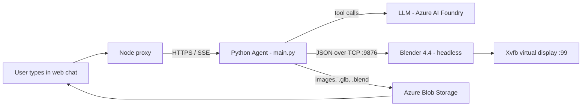

# Demo Script — *When Python Agents Meet 3D: Automating Blender from Natural Language*

**EuroPython 2026 · Fri 17 Jul · 12:25–12:55 · Room S3B · 30 min · Level: Intermediate**
Track: *Python For Games, Art, Play And Expression*

This is your talk companion. It tells you **which files to open on screen**, **what to say about each one to a newcomer**, and **which Python patterns to call out** for a Python developer audience. Everything is pointed at exact file/line ranges so you can jump straight there live.

> Golden rule for a 30‑min slot: **you cannot show all 6,500 lines.** This script picks ~7 code locations that carry the whole story. Everything else is "mention and move on".

---

## 0. The 30‑minute budget (recommended)

| Time | Segment | What's on screen |
|------|---------|------------------|
| 0:00–3:30 | **WOW demo** (web chat, end‑to‑end) | The web chat client, live |
| 3:30–5:30 | **The mental model** | One architecture diagram |
| 5:30–9:00 | **Origin story: Blender MCP + the TCP protocol** | [blender_startup.py](blender_startup.py) |
| 9:00–13:00 | **Tools = typed Python functions** | [main.py](main.py) tools + agent wiring |
| 13:00–15:00 | **The local dev loop** (Docker + Foundry Toolkit playground) | Terminal + Toolkit |
| 15:00–18:30 | **Platform value: the Foundry portal** (sessions · files · telemetry) | Foundry portal + App Insights |
| 18:30–24:30 | **Lessons learned** (prompt hardening · crash recovery · idle/resume) | [scene_manager.py](scene_manager.py) + [main.py](main.py) |
| 24:30–26:30 | **Same agent in M365 Copilot / Teams** | Teams, live |
| 26:30–28:30 | **Human‑in‑the‑loop framing + limitations** | Slides |
| 28:30–30:00 | **Close + repo link** | Slide |

If you run long, compress the origin story (§3) and the local dev loop (§5), and shorten the portal tour (§6) to just the telemetry waterfall. **Never cut the Lessons‑learned segment (§7)** — it is the most original engineering content and the thing nobody else in the room has built.

---

## 1. Open with the WOW demo (0:00–3:30)

**Do not explain anything first. Just type into the chat.** Let the audience see natural language become 3D.

Use the exact prompts from the README so they're battle‑tested:

1. First prompt (build + render):
   > *"Create a fantasy world for kids, use basic primitives to build 6 houses and 10 trees. A kid should later be able to navigate in this 3D world on a path connecting each house. Give me a high fidelity rendering at the end."*
2. While it runs, **narrate what the audience is seeing**:
   - Status pills appearing ("Setting up the scene…", "Creating object…", "Rendering the final image…") — *those are streamed live from the agent, not canned.*
   - The rendered image appears **inline** in the chat.
3. Second prompt (iterate — proves human‑in‑the‑loop):
   > *"Add a plastic yellow sphere on the tallest house's roof"*
   - Point out: it **did not rebuild the world** — it kept your scene and only added one object. That continuity is the whole "programmable collaborator" thesis.
4. Money shot (the Babylon.js callback — you *wrote* Babylon.js, so own it):
   > *"give me the GLB version"*
   - A download link appears; click it → the **in‑chat Babylon.js viewer** opens the actual 3D scene you can orbit. Same scene, now interactive in the browser.

**One sentence to land the demo:** "Every single thing you just saw is Python calling Blender's Python API, wrapped as agent tools, running headless in the cloud."

> **Backup plan:** renders take real seconds and depend on the cloud. Have a **pre‑recorded 60‑sec screen capture** ready. If the live model is slow, talk over the recording.

---

## 2. The mental model (3:30–5:30)

Put up **one** diagram (there's an ASCII version in [README.md](README.md) you can prettify). Say it out loud like this:



Four moving parts, all glued by Python:
1. **The LLM** decides *what* to do.
2. **The Python agent** ([main.py](main.py)) exposes *tools* and talks to Blender.
3. **Headless Blender** actually does the 3D work, driven by its Python API (`bpy`).
4. **Blob storage** ferries the pixels and 3D files back to the browser.

The key framing for this audience: *"The LLM is the brain, but Python is the entire nervous system — it's the bridge between the model, Blender's scripting API, cloud storage, and the hosted runtime."*

---

## 3. Origin story: from Blender MCP to a TCP protocol (5:30–9:00)

**Narrative:** "I didn't invent the Blender‑control part. I started from the open‑source [Blender MCP](https://github.com/ahujasid/blender-mcp) project, which runs a tiny socket server *inside* Blender. I adapted it to run headless."

Open **[blender_startup.py](blender_startup.py)** — this is the code that runs *inside* the Blender process.

### 3a. A socket server living inside Blender
- [blender_startup.py](blender_startup.py#L40-L64) — `BlenderMCPServer` binds a TCP socket on port 9876 and accepts one client (the agent).
- The protocol is dead simple: **JSON over TCP**, no framework. Command in, JSON result out.

### 3b. ⭐ Python pattern #1 — thread‑safety via Blender's main‑thread timer
This is the single most interesting concurrency detail for a Python audience.

- [blender_startup.py](blender_startup.py#L116-L170) — the socket runs on a **background thread**, but **`bpy` is not thread‑safe**. You cannot touch the scene from another thread or Blender crashes.
- The fix: the client handler wraps the work in a closure and calls
  [`bpy.app.timers.register(execute_wrapper, first_interval=0.0)`](blender_startup.py#L165-L167).
  That **marshals the work onto Blender's main thread** on the next tick — the classic "post work back to the UI/main thread" pattern, done in pure Python.

**Say:** "Any Python dev who's fought a non‑thread‑safe GUI toolkit will recognize this: receive on a worker thread, but *execute* on the main thread. Blender gives us a timer queue to do exactly that."

### 3c. The command dispatcher
- [blender_startup.py](blender_startup.py#L192-L237) — `_execute_command_internal` is a **dict‑dispatch table** (`handlers = {...}`), the Pythonic alternative to a giant `if/elif`. Poly Haven handlers are merged in conditionally.

### 3d. ⭐ Python pattern #2 — `exec()` with a curated namespace + captured stdout
- [blender_startup.py](blender_startup.py#L433-L461) — `execute_code` runs arbitrary model‑generated Python inside Blender. Two things worth showing:
  - It builds an **explicit namespace dict** (`bpy`, `mathutils`, `Vector`, plus safe helper closures) so the model has exactly the tools it needs — [see `_blender_helpers`](blender_startup.py#L388-L432), which injects closures like `safe_move_to_collection`.
  - It captures the code's output with [`contextlib.redirect_stdout(io.StringIO())`](blender_startup.py#L455-L458) so `print()` results flow back to the LLM.

**Say:** "This is the escape hatch. When the model needs something we didn't build a tool for, it just writes Blender Python and we `exec` it — inside a namespace we control."

### 3e. How it boots headless
- [blender_startup.py](blender_startup.py#L1082-L1112) — on startup it clears the default cube/camera/light and downloads a neutral studio HDRI so scenes start empty but well‑lit. Again started via a **deferred timer** so Blender is fully initialized first.

---

## 4. Tools are just typed Python functions (9:00–13:00)

This is the segment your audience came for. Switch to **[main.py](main.py)**.

### 4a. ⭐ Python pattern #3 — `Annotated` type hints become the LLM tool schema
Open [`create_object`](main.py#L438-L488). This is the perfect teaching example.

```python
def create_object(
    object_type: Annotated[str, "Type of primitive: 'cube', 'sphere', ..."],
    name: Annotated[str, "Name for the new object"] = "Object",
    location_x: Annotated[float, "X position"] = 0.0,
    ...
) -> str:
    """Create a 3D primitive object in the Blender scene."""
```

**Say:** "There is no schema file. The Agent Framework reads the **function signature**, the **`typing.Annotated` metadata**, and the **docstring**, and generates the JSON tool schema the LLM sees. The docstring is the prompt; the type hints are the contract. This is the most Python‑native way to define a tool I've seen."

Then show how the tool body just **generates Blender Python and sends it over the socket** ([main.py](main.py#L473-L481)) — the same `execute_code` command from segment 3.

### 4b. The full toolset in one glance
- [main.py](main.py#L2247-L2264) — the `tools=[...]` list. 16 functions: inspect, create, modify, material, render, screenshot, Poly Haven assets, download/export. Scroll it once; don't read them all.

### 4c. ⭐ Python pattern #4 — regex auto‑patching of model output
The LLM sometimes emits Blender 3.x API that was removed in 4.x. Rather than only relying on the prompt, there's a **safety net in code**.
- [main.py](main.py#L762-L814) — `execute_blender_code` runs a table of string replacements (deprecated node names, renamed Principled‑BSDF inputs) and uses a **compiled `re` pattern with a function replacement** ([`_unlink_pattern.sub(_wrap_unlink, code)`](main.py#L787-L814)) to rewrite an unsafe collection‑unlink into a safe loop.

**Say:** "Prompt engineering is not enough. When you let a model write code, add deterministic guardrails in Python. Here it's `re.sub` with a callable replacement — belt and suspenders."

### 4d. How the agent is wired (the "no magic" moment)
Open [`main()`](main.py#L2095-L2270):
- [main.py](main.py#L2216-L2221) — `FoundryChatClient(project_endpoint=..., model=..., credential=DefaultAzureCredential())`.
  - Call out **`DefaultAzureCredential`**: same code path works locally (`az login`) and in the cloud (managed identity). *Passwordless — no secrets in the repo.*
- [main.py](main.py#L2243-L2246) — `Agent(client=..., middleware=[...], instructions="""...""", tools=[...])`.
- [main.py](main.py#L2269) — `ResponsesHostServer(agent).run_async()` turns the agent into an HTTP server speaking the OpenAI *Responses* protocol.

**Say:** "That's the entire server. A chat client, an agent, a list of Python functions, and a host. The `agent.yaml` next to it is the *only* place the agent's identity and resources live" — flash [agent.yaml](agent.yaml) for 5 seconds (name, `kind: hosted`, cpu/memory, env vars).

---

## 5. The local dev loop (13:00–15:00)

**Narrative:** "Before this ever touches the cloud, I test the whole thing locally. Two pieces make that fast."

### 5a. One container runs everything
Open [Dockerfile](Dockerfile) and [entrypoint.sh](entrypoint.sh):
- [Dockerfile](Dockerfile#L11-L45) — Ubuntu + **Xvfb** (a virtual display so headless Blender has a GL context) + Blender 4.4 + a Python venv.
- [entrypoint.sh](entrypoint.sh#L143-L268) — a **supervisor loop** starts Xvfb, then Blender, then the agent, and restarts Blender if it dies. Point at [the supervisor `while true` loop](entrypoint.sh#L232-L267).

**Say:** "One container, three processes: a fake display, Blender, and the Python agent talking to it over localhost TCP. `docker run` and it's the same thing that runs in production."

### 5b. The Foundry Toolkit playground
- Show the VS Code **AI Toolkit / Foundry** playground hitting `http://localhost:8088`. This is your inner loop: edit a Python tool → rerun → chat → watch the tool fire. No cloud round‑trip.
- Mention the tasks in this repo (`Run Agent/Workflow HTTP Server` on port 8088, `Open Agent Inspector`) — that's the one‑click local run.

### 5c. Two runtimes, one client (nice architecture beat)
Open [webchat/server/src/index.ts](webchat/server/src/index.ts#L156-L219): `buildUpstreamRequest` has a **`local` branch and a `foundry` branch**. Same web UI, same protocol; only the URL, auth header, and session handling differ. Great slide to show "dev/prod parity".

> Keep the TypeScript light — this is a Python talk. One 20‑second look is enough. (Fun aside you can drop: the in‑chat 3D viewer is **Babylon.js**, which you co‑authored — [BabylonViewer.tsx](webchat/client/src/components/BabylonViewer.tsx).)

---

## 6. Platform value: the Foundry Hosted Agent portal (15:00–18:30)

**Narrative:** "Everything so far was *my* code. Now let me show what the *platform* hands me for free once this is deployed as an Azure AI Foundry **Hosted Agent**." Switch from VS Code to the **Foundry portal**.

### 6a. Every session is recorded
- Open the agent → the **Sessions / Threads** list. Each row is one conversation (one micro‑VM). Click one to **replay the whole exchange**: the user's prompts, the agent's tool calls, and the images it returned.
- **Say:** "I wrote none of this logging UI. Because the agent speaks the standard *Responses* protocol and is declared `kind: hosted` in [agent.yaml](agent.yaml), Foundry records and lets me inspect every session."

### 6b. The file system is real — renders live on disk *and* in Azure
One render exists in three forms; show two of them side by side:
- **On the micro‑VM disk:** browse the container and show `$HOME/tmp/` filling with `screenshot_*.png` / `render_*.png`, and `$HOME/blender_scenes/scene.blend`. Those local copies come from [`_PERSISTENT_TMP`](main.py#L91-L96) and are kept on purpose so the latest render survives an idle/resume for post‑mortem debugging.
- **In Azure Blob Storage:** open Storage Explorer → the `screenshots` container → the *same* images. That's [`upload_image_to_blob`](main.py#L141-L178): every image is uploaded and handed back to the chat as a **1‑hour user‑delegation SAS URL**, which is how any client can display it without a public bucket.
- **Say:** "On the VM disk for durability, in Blob Storage for delivery, and as a short‑lived SAS link in the chat — passwordless end to end via [DefaultAzureCredential](main.py#L2216-L2221) plus one scoped RBAC role."

### 6c. Telemetry: the tool‑call waterfall
- Open **Application Insights → the Gen AI / Agent Runs** view for one request. You get a **span waterfall**: `invoke_agent` → `chat` (the LLM call) → one `execute_tool` span per tool (`setup_scene`, `create_object`, `render_final`, …), each with its own latency.
- **Say:** "This is my single most useful debugging view. When a scene takes 40 seconds, the waterfall tells me instantly whether it was the model thinking, Blender rendering, or a Poly Haven download."
- How it's wired (tiny, worth one slide): [agent.yaml](agent.yaml#L31-L44) opts in with `ENABLE_INSTRUMENTATION` / `ENABLE_SENSITIVE_DATA`, and [`main()`](main.py#L2115-L2131) calls `enable_instrumentation()`. Foundry injects the App Insights connection string at deploy time — **zero** telemetry plumbing in my code.

---

## 7. ⭐ Lessons learned — making it production‑robust (18:30–24:30)

**This is your signature content — the "why is there so much code around a simple idea" payoff. Slow down here.** Three hard lessons, each earned by a real failure.

### Lesson 1 — Harden the prompt so the model stops breaking Blender's API
The model learned from years of **Blender 3.x** snippets, but this container runs **Blender 4.4**, where many shader nodes and Principled‑BSDF inputs were renamed or removed. Left alone, a meaningful fraction of generated scripts threw `AttributeError`. Two layers of defense:
1. **Prompt as spec** — the [agent instructions](main.py#L2162-L2245) carry an explicit *"Blender 4.x API Compatibility"* section: every removed node (`ShaderNodeTexMusgrave` → `ShaderNodeTexNoise`), every renamed input (`'Specular'` → `'Specular IOR Level'`), plus workflow rules ("take ONE screenshot at the end", "`modify_object` takes absolute values, so read state first").
2. **Code as safety net** — [`execute_blender_code`](main.py#L762-L814) still runs a deterministic replacement table **and** a `re.sub` guardrail before the code ever reaches Blender.
- **Say:** "The lesson: treat the system prompt like an API contract — but never trust it alone. Every rule I *could* enforce in Python, I moved into Python. Prompts are best‑effort; code is guaranteed."

### Lesson 2 — Assume Blender *will* crash, and recover without losing work
Heavy glTF imports and big renders occasionally take the whole Blender process down. Three mechanisms cooperate:
1. **Detect vs. distinguish** — [`_is_blender_crash_error`](main.py#L296-L311) separates *the connection died* (a real crash, retry) from *`bpy` raised a normal error* (hand it back to the model to self‑correct). Getting this wrong once meant resetting the scene on every harmless error and wiping in‑progress work.
2. **Recover + circuit‑break** — [`_recover_blender_scene`](main.py#L312-L360) waits for the supervisor to restart Blender, reloads the saved scene, and **caps recovery at 2 crashes per conversation** so a poison input can't loop forever.
3. **Never save a corrupt scene** — ⭐ the **epoch guard** in [scene_manager.py](scene_manager.py#L207-L241): a monotonic counter bumped on every Blender reconnect lets `save_scene` detect *"the Blender I'm about to save from is not the one I loaded"* and **refuse to overwrite** the good file with an empty default scene.
- Bonus, for turns that are *slow* rather than crashed: the ⭐ **heartbeat + hard timeout** in [`ToolStatusMiddleware`](main.py#L1519-L1590) — a background `_pump()` task feeds an `asyncio.Queue` so the consumer can inject *"Still working…"* every 30s and cap the turn **without cancelling the in‑flight HTTP read** (which would break the stream).
- **Say:** "A single integer — the epoch — is the whole difference between 'Blender crashed but your world is safe' and silently deleting someone's scene."

### Lesson 3 — Survive the micro‑VM idle → resume without losing the scene

**Set up the problem first (no code yet):**
> "Most hosted agents are stateless — a turn is just text in, text out. Mine is different: it owns a **long‑running Blender process holding the user's 3D scene in memory**. And the hosting platform, Azure AI Foundry, runs each agent in a **micro‑VM that pauses after ~15 minutes of inactivity** and resumes on the next request. Resume keeps the **disk** but wipes **memory** — including the Blender process. So how do I not lose the user's world?"

Put up the persistence table from the README (what survives idle, what doesn't). Then show the two files that solve it.

#### 7a. One scene per VM — `SceneManager`
Open [scene_manager.py](scene_manager.py#L1-L33) — read the module docstring; it explains the insight: **one micro‑VM = one conversation**, so there's exactly one scene file at `$HOME/blender_scenes/scene.blend`. `$HOME` survives the pause; memory doesn't.
- [scene_manager.py](scene_manager.py#L155-L206) — `activate_scene` (load the `.blend` or reset clean) and `save_scene`.

#### 7b. The middleware that orchestrates it — ⭐ async‑generator + `finally`
Open [main.py](main.py#L2243-L2244): the agent is wrapped with **composed middleware**:
```python
middleware=[SceneIsolationMiddleware(ToolStatusMiddleware(), scene_manager)]
```
- **Outer** = [`SceneIsolationMiddleware`](main.py#L1699-L1735): its [`process(context, call_next)`](main.py#L1937-L2093) runs **before** the agent (activate/restore the scene) and **after** (save it).
- ⭐ **Async‑generator wrapping with a `finally` block** — [main.py](main.py#L2033-L2088): because responses are *streamed*, "after the agent" means *after the last chunk*. So it wraps the stream in an async generator and saves the scene in a `finally`. This is a beautiful demonstration of `async for` + `finally` for lifecycle work around a stream.

**Say:** "Middleware here is just an object with an async `process(context, call_next)` method — the same onion model as web frameworks. I compose two of them. The outer one owns scene lifecycle: restore before, save after. And because the response is a stream, 'save after' literally means inside the `finally` of an `async for` loop."

#### 7c. What the user actually sees + boot hygiene
Tie it back to the demo: those `🔄 restarting…` / `📂 restoring your scene…` / `✅ ready` lines the audience *might* have seen are these `recovery_messages` streamed from [main.py](main.py#L1975-L2020) before the model's first token. Boot‑hygiene detail worth one sentence: [entrypoint.sh](entrypoint.sh#L108-L130) **deletes stale Xvfb lock files on every boot** because a resumed VM keeps `/tmp` — a great "trust nothing on resume" lesson.

> **The reusable takeaway slide** (straight from the README's playbook): if you ever co‑host a stateful native process (a DB, a game engine, Blender) inside a suspend/resume runtime — (1) clean transient resources on boot, (2) treat `$HOME` as the state store, (3) don't multiplex, lean on the 1:1 VM↔conversation binding, (4) probe your dependency before touching it and stream a status while you wait.

---

## 8. Same agent, new front door: Microsoft 365 Copilot & Teams (24:30–26:30)

**The payoff of the hosted‑agent model is portability.** The web chat you demoed is just *one* client of the Responses protocol. The exact same deployed agent — no code change, same [agent.yaml](agent.yaml) — can be surfaced inside **Microsoft 365 Copilot and Teams**.

- **Do the demo:** open Teams, message the published Blender agent: *"Add a red torus above the table and render it."* The same tools fire in the same cloud micro‑VM; the render comes back **inline in the Teams chat**.
- **Why it just works:** the agent returns Markdown (``) and download links, and Copilot / Teams render those natively. The scene‑persistence and idle/resume machinery from §7 is identical — Teams is simply another caller of the same session.
- **Say:** "This is the real argument for a *hosted* agent instead of a bespoke server: I wrote the Blender bridge once, and it runs behind a web app, inside VS Code's playground, and inside Microsoft 365 Copilot — same code, three surfaces."

> If a live Teams demo is risky (tenant/policy), a 20‑second screen recording of the Teams chat returning a render lands the point just as well.

---

## 9. Human‑in‑the‑loop framing + limitations (26:30–28:30)

Return to the abstract's thesis. Slides, no code:
- **Collaborator, not replacement.** The second demo prompt proved it: the agent *edited* the scene instead of regenerating it. Artists stay in control at every step — inspect, modify, refine.
- **Where this goes:** faster prototyping for game world‑building, virtual production, architectural viz — idea → editable Blender scene in seconds.
- **Be honest about limits** (this earns credibility):
  - The model still writes wrong Blender 4.x API sometimes — hence the [regex auto‑patches](main.py#L762-L814) and the compatibility rules baked into the [instructions](main.py#L2162-L2245).
  - Heavy assets/imports can crash Blender — hence the [crash detection + circuit breaker](main.py#L296-L360) (max 2 recoveries per conversation).
  - It's spatial reasoning by a language model: great at "12 cubes around a table", weaker at precise art direction. Human refinement closes the gap.

---

## 10. Close (28:30–30:00)

- One line: *"Natural language in, an editable 3D scene out — and the whole bridge is Python."*
- Show the repo, the [README.md](README.md) (great architecture write‑up), and the two credited OSS projects: **Blender MCP** and **Poly Haven**.
- Invite questions.

---

## Appendix A — Cheat sheet: exact locations to open live

| Beat | File + lines | One‑liner |
|------|--------------|-----------|
| Socket server inside Blender | [blender_startup.py](blender_startup.py#L40-L64) | JSON‑over‑TCP on :9876 |
| Main‑thread marshaling | [blender_startup.py](blender_startup.py#L165-L167) | `bpy.app.timers.register` |
| Command dispatch table | [blender_startup.py](blender_startup.py#L203-L237) | dict dispatch, not if/elif |
| `exec` + captured stdout | [blender_startup.py](blender_startup.py#L433-L461) | curated namespace |
| Tool = typed function | [main.py](main.py#L438-L488) | `Annotated` → schema |
| Regex guardrail | [main.py](main.py#L787-L814) | `re.sub` with callable |
| Agent wiring | [main.py](main.py#L2216-L2269) | client + middleware + tools + host |
| DefaultAzureCredential | [main.py](main.py#L2216-L2221) | passwordless auth |
| Scene persistence insight | [scene_manager.py](scene_manager.py#L1-L33) | one VM = one scene |
| Epoch corruption guard | [scene_manager.py](scene_manager.py#L207-L241) | monotonic counter |
| Scene isolation middleware | [main.py](main.py#L1937-L2093) | restore before / save after (in `finally`) |
| Heartbeat via queue | [main.py](main.py#L1519-L1590) | producer/consumer asyncio |
| Container supervisor | [entrypoint.sh](entrypoint.sh#L232-L267) | restart Blender if it dies |
| Boot hygiene | [entrypoint.sh](entrypoint.sh#L108-L130) | clean stale Xvfb locks |
| local vs foundry | [webchat/server/src/index.ts](webchat/server/src/index.ts#L156-L219) | one client, two runtimes |
| Babylon.js viewer | [webchat/client/src/components/BabylonViewer.tsx](webchat/client/src/components/BabylonViewer.tsx) | your engine, inline 3D |
| Renders kept on disk | [main.py](main.py#L91-L96) | `$HOME/tmp` survives idle |
| Render → Blob + SAS URL | [main.py](main.py#L141-L178) | `upload_image_to_blob` |
| Telemetry opt‑in | [agent.yaml](agent.yaml#L31-L44) · [main.py](main.py#L2115-L2131) | `enable_instrumentation()` |
| Prompt as API contract | [main.py](main.py#L2162-L2245) | Blender 4.x compat rules |
| Crash detect vs app error | [main.py](main.py#L296-L360) | recover + circuit breaker |

## Appendix B — Python patterns to name‑drop (audience bait)

1. `typing.Annotated` metadata → auto‑generated LLM tool schemas ([main.py](main.py#L438-L488)).
2. Compose async middleware: `process(context, call_next)` onion model ([main.py](main.py#L1937-L1940)).
3. Wrap a stream, do cleanup in the `finally` of an `async for` ([main.py](main.py#L2033-L2088)).
4. `asyncio.Queue` + `asyncio.wait_for` for heartbeats without cancelling a read ([main.py](main.py#L1519-L1590)).
5. `bpy.app.timers.register` to marshal worker‑thread work onto the main thread ([blender_startup.py](blender_startup.py#L165-L167)).
6. `exec(code, namespace)` with injected closures + `contextlib.redirect_stdout` ([blender_startup.py](blender_startup.py#L433-L461)).
7. Incremental JSON framing over TCP: `json.loads` on accumulated chunks until it parses ([blender_connection.py](blender_connection.py#L70-L115)).
8. `@dataclass` socket client + module‑level singleton accessor ([blender_connection.py](blender_connection.py#L37-L60)).
9. A monotonic "epoch" counter as a cheap state‑versioning / corruption guard ([scene_manager.py](scene_manager.py#L207-L241)).
10. Atomic file writes with `os.replace(tmp, path)` for the session‑state JSON ([scene_manager.py](scene_manager.py#L86-L96)).
11. `DefaultAzureCredential` for identical local/cloud passwordless auth ([main.py](main.py#L2216-L2221)).
12. Split logging: DEBUG/INFO→stdout, WARNING+→stderr, rotating file in `$HOME` ([main.py](main.py#L44-L79)).
13. One‑shot init via a function attribute (`_log_storage_principal_once._done = True`) ([main.py](main.py#L114-L140)).
14. Decode a JWT payload by hand — base64url + manual `=` padding — for a diagnostic log line ([main.py](main.py#L114-L140)).

## Appendix C — Demo prompts (copy/paste)

```text
1) Load a table from Poly Haven, place it at the center, create 12 metallic cubes of
   various colors around it and share a high fidelity rendering of the result

2) Add a plastic yellow sphere on top of the table

3) Create a fantasy world for kids, use basic primitives to build 6 houses and 10 trees.
   A kid should later be able to navigate in this 3D world on a path connecting each house.
   Give me a high fidelity rendering at the end

4) give me the GLB version   ← then open the in-chat Babylon.js viewer (or drag the .glb
   into https://sandbox.babylonjs.com)
```

## Appendix D — If a demo fails live

- **Render is slow / model stalls:** cut to the pre‑recorded clip; keep narrating the status pills.
- **Blender crashed message appears:** *use it!* It's a real feature — show the [crash recovery + circuit breaker](main.py#L296-L360) and say "this is exactly why that code exists."
- **Cloud auth hiccup:** fall back to the **local Docker + Foundry Toolkit playground** (§5) — same agent, no cloud.
- **Portal / telemetry slow to load:** pre‑open the Foundry **Sessions** view and the App Insights **Gen AI waterfall** in background tabs *before* the talk, and screenshot them as slides in case the portal lags.
- **Teams demo blocked (tenant/policy):** play a 20‑second screen recording of the Teams chat returning a render — the portability point survives.
